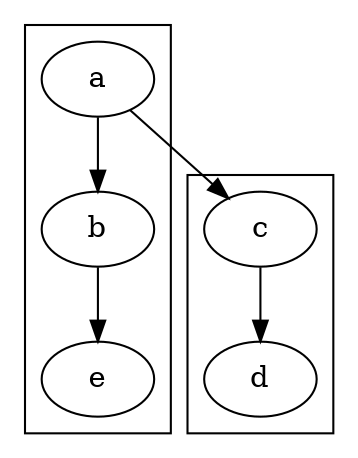

<!-- SPDX-License-Identifier: EPL-2.0 -->

# newrank rank-reconciliation — TS vs dot oracle (T4, RESCOPED)

## Status

**RESCOPED** per AD-4. `removeFill` is fully ported and faithful
(`lib/dotgen/dotinit.c:removeFill` → `src/layout/dot/init.ts`). Full newrank
parity is **unreachable through T4's declared write-set** (`init.ts` +
`newrank.test.ts`) because the two blocking defects live elsewhere. Current
behaviour is **non-regressed**: 1834 tests pass, 122 goldens byte-identical.

## Repro



Oracle: `GVBINDIR=/tmp/gvplugins ~/git/graphviz/build/cmd/dot/dot -Tsvg`,
2026-06-17 (`/tmp/newrank-repro.dot`).

## Node table (ellipse `cy`, SVG frame)

| node | rank (oracle) | oracle cy | TS cy (current) | match |
|------|---------------|-----------|-----------------|-------|
| a    | 0             | -178      | -178            | yes   |
| b    | 1             | -106      | -106            | yes   |
| c    | 1 (= b)       | **-106**  | **-178**        | **no — c sits on a's rank** |
| e    | 2             | -34       | -34             | yes   |
| d    | 2             | **-34**   | **-106**        | **no — d follows c up one rank** |

The defect: without rank reconciliation, `c` aligns with `a` (rank 0) instead
of `b` (rank 1), and `d` shifts up correspondingly. The oracle's `fillRanks`
inserts placeholder nodes that make the cross-cluster `rank=same; b; c`
reconcile globally.

## Root cause — two defects, both outside the T4 write-set

### 1. `dotRank` never sets `NEW_RANK` from the `newrank` attribute

`src/layout/dot/rank.ts:dotRank` tests the flag but never reads the graph
attribute that sets it. The C is:

```c
/* lib/dotgen/rank.c:521 */
void dot_rank(graph_t *g) {
    if (mapbool(agget(g, "newrank"))) {
        GD_flags(g) |= NEW_RANK;
        dot2_rank(g);
    } else
        dot1_rank(g);
}
```

The TS only does `if ((g.info.flags ?? 0) & NEW_RANK)`, with nothing ever
OR-ing in `NEW_RANK` from `mapbool(g.attrs.get('newrank'))`. Result:
`dot2Rank` / `fillRanks` never run for `newrank=true`, so removeFill is a no-op
(there is no `_new_rank` subgraph to clean) and the rank stays unreconciled.

Fix location: `src/layout/dot/rank.ts` — **outside T4's write-set.**

### 2. Forcing the flag exposes an infinite loop in `furthestNode`

Patching `dotRank` to read the attribute (verified locally, then reverted)
makes `renderSvg` hang. V8 `--prof` of an esbuild bundle attributes 81.6% of
ticks to `furthestNode` (`src/layout/dot/mincross-utils.ts:161`):

```
[JavaScript]:
  ticks  total  nonlib   name
 11623  81.6%  100.0%  JS: *furthestNode  ...:16844:22
```

`furthestNode` walks `neighborNode(ctx, u, dir)` by `order` index until it
returns `undefined`. With the fill placeholders inserted by `fillRanks`, the
walk never terminates — the fill-node `order` indices make `rk.v[order+1]`
keep yielding a node. This hang occurs in `dotMincross`, well **before**
`removeFill` runs, so it is not a removeFill defect.

Fix location: the `dot2Rank` / `fillRanks` / mincross-ordering interaction —
**outside T4's write-set.**

## What T4 delivered (in scope, complete)

- `removeFill(g)` ported faithfully (`init.ts`): looks up `_new_rank` under
  `g.root`, snapshots its members, and for each runs `deleteFastNode` →
  `removeFromRank` → `agdelnode`, then `agdelsubg`. Iteration-safe against the
  in-loop membership mutation (mirrors C's `nxt = agnxtnode` look-ahead).
  `dot_cleanup_node` is intentionally skipped — no equivalent in this port (GC
  reclaims the deleted node).
- `newrank.test.ts` pins the in-scope non-regression invariants (renders
  without hanging; no `_new_rank` / `__fill_` / anonymous node renders; exactly
  five real nodes; one-rank 72pt spacing) and regression-guards the residual
  (current TS centers vs oracle) so the file flips to a parity pin once the two
  upstream defects are fixed.

## Follow-up (next mission, outside T4)

1. Port the `mapbool(agget(g,"newrank"))` flag-set into `dotRank`
   (`rank.ts`).
2. Fix the `furthestNode` non-termination with fill placeholders present
   (`mincross-utils.ts` / `mincross-build.ts` `fillRanks` ordering).
3. Then flip `newrank.test.ts`'s RESIDUAL assertions to the ORACLE targets
   (c aligns with b ≤0.5pt; flag moves c off a's rank).
