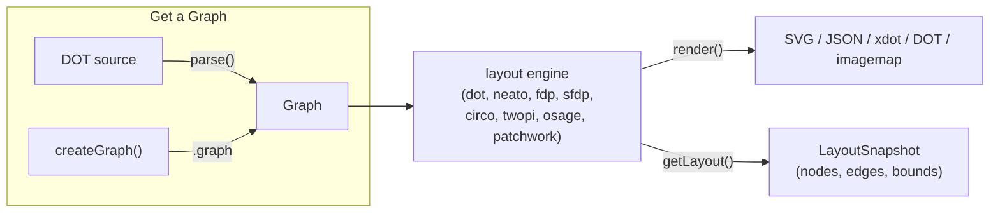

# Overview

graphviz-ts is a line-by-line TypeScript port of [Graphviz](https://graphviz.org/):
DOT source (or a graph built in code) goes in, SVG — or JSON, xdot, DOT, or an
image map — comes out, computed entirely in TypeScript with no native
Graphviz binary and no WASM. If you haven't rendered anything yet, start at
[Getting started](/guide/getting-started); this page is the map that sits
above it — what the library is doing, and which of its three entry points to
reach for.

## The pipeline

Every render, regardless of which entry point kicks it off, follows the same
shape: get a `Graph` (by parsing DOT or building one programmatically), run a
layout engine over it, then either serialize the result or read the computed
geometry back off the same graph object.

There is no separate "run layout" call: `renderSvg` and `render` trigger
layout as part of rendering, and the computed coordinates (node positions,
edge splines, bounding box) are retained on the `Graph` object afterward.
`getLayout` doesn't re-run layout — it reads geometry that a prior `render`
call already computed, so it's always called *after* `render`, on the same
graph.

## The three entry points — which door?

graphviz-ts ships three entry points: the root package re-exports everything
from the other two, so you only need to reach past it when you want a
narrower import surface.

| I want to…                                            | Use                                    |
|--------------------------------------------------------|-----------------------------------------|
| Turn DOT text into an SVG string, fast                  | `graphviz-ts` — `renderSvg(dot, engine)` |
| Parse DOT without rendering it                          | `graphviz-ts` — `parse(dot)`             |
| Configure text measurement or image resolution globally | `graphviz-ts` — `setTextMeasurer`, `setImageSizer`, `setImageResolver` |
| Build a graph in code, no DOT text                      | `graphviz-ts/api` — `createGraph`, `addEdge` |
| Read back computed node/edge/cluster positions           | `graphviz-ts/api` — `getLayout`          |
| Render to a format other than SVG (JSON, xdot, DOT, image map) | `graphviz-ts/render` — `render(g, format, opts?)` |
| Drive a custom canvas/WebGL/PDF backend                  | `graphviz-ts/render` — `getDrawOps`      |

`graphviz-ts/api` is the *build + inspect* door: construct a graph
programmatically and read geometry off it. `graphviz-ts/render` is the
*output* door: turn a graph (from either `parse()` or the builder) into a
serialized format or a structured draw-op stream. The root `graphviz-ts`
package re-exports both, plus the one-shot `renderSvg` convenience function
and the global configuration hooks — most projects only ever import from
the root.

## Coordinate frames, briefly

Native graphviz coordinates are y-up, origin at the lower-left — the
convention the layout engines compute in. Most screen and canvas consumers
want y-down, origin at the upper-left. `getLayout` defaults to `yAxis:
'down'` and flips for you; the raw string formats (`svg`, `json`, `xdot`,
`plain`) carry native y-up coordinates unchanged. See
[Read computed geometry](/guide/geometry) for the full coordinate reference,
and [Recipes](/guide/recipes) for the flip-and-reconcile pattern when you
need to mix `getLayout` output with a raw format's coordinates.

## Scope boundary

graphviz-ts renders to SVG, JSON, xdot, DOT, and HTML image maps (`imap` /
`cmapx`) — the deterministic, string- or structure-based output formats. It
does not produce raster images (PNG, JPEG) or PDF, and it has no GUI viewer;
those are out of scope for a browser-safe pure-TypeScript port. Known
differences from native Graphviz's behavior — not gaps in output format, but
places where the port's output diverges — are tracked on the
[Divergences](/divergences) page.

## Where to go next

- [Getting started](/guide/getting-started) — install and render your first graph.
- [Layout engines](/guide/engines) — the eight engines and when to use each.
- [Build a graph in code](/guide/build-a-graph) — the `graphviz-ts/api` builder.
- [Read computed geometry](/guide/geometry) — `getLayout`, coordinate frames, units.
- [Recipes](/guide/recipes) — common task-based patterns.
- [Images](/guide/images) — `setImageSizer`, `setImageResolver`, inlining.
- [Types reference](/guide/types) — full shapes for every exported type.
- [API reference](/reference/) — generated per-symbol documentation.
- [Glossary](/guide/glossary) — Graphviz and graphviz-ts terminology.
