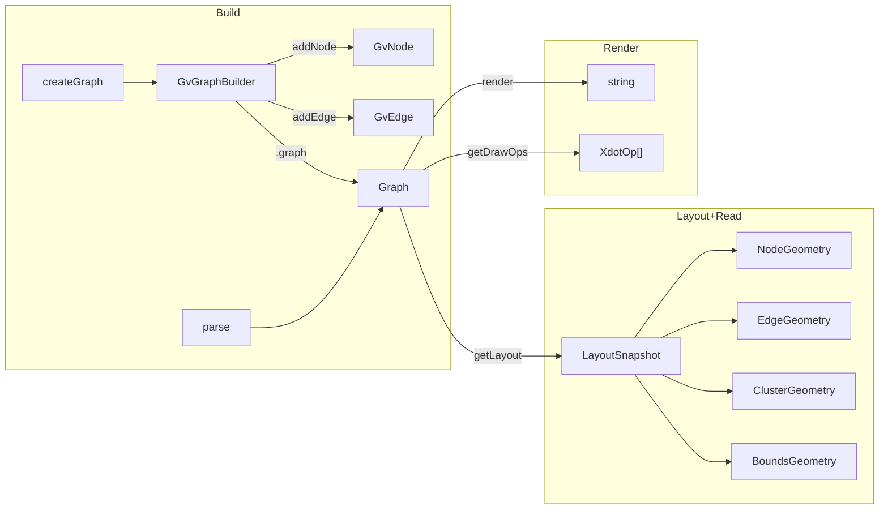

# Types reference

A conceptual map of the public types, grouped by where you get them from:
`createGraph`/`parse` (build + inspect), `getLayout` (geometry snapshot),
`render`/`getDrawOps` (output), and the root package (engines, images, text
measurement, errors). Each entry shows a shape block copied from source and a
one-line purpose. For exhaustive field-by-field documentation (including
inherited members and JSDoc on every property), see the generated
[TypeDoc reference](/reference/).

This page does not repeat the coordinate-frame walkthrough — see
[Read computed geometry](/guide/geometry) for that. It does restate the
y-axis note briefly wherever a type's fields are frame-dependent.

## Build + inspect (`graphviz-ts` / `graphviz-ts/api`)

### `Graph`

An opaque handle to the internal graph model. Returned by `parse()` and by
`createGraph().graph`. Pass it to `render`, `getLayout`, and `getDrawOps`;
do not construct or inspect it directly — the builder and parser are the only
supported ways to produce one.

### `CreateGraphOptions`

```ts
interface CreateGraphOptions {
  directed?: boolean;
  strict?: boolean;
  name?: string;
}
```

Options for `createGraph`. `directed`/`strict` select one of the four
`GraphKind`s (directed, undirected, strict-directed, strict-undirected);
`name` sets the graph's name (default `''`).

### `GvNode`

```ts
interface GvNode {
  readonly name: string;
  setAttr(k: string, v: string): void;
  setHtmlAttr(k: string, v: string): void;
  getAttr(k: string): string | undefined;
}
```

Opaque handle for a graph node returned by `builder.addNode(...)`.
`setHtmlAttr` tags the value as an HTML-like label (equivalent to
`label=<...>` in DOT text) so the layout engine measures it as markup.

### `GvEdge`

```ts
interface GvEdge {
  readonly tail: string;
  readonly head: string;
  setAttr(k: string, v: string): void;
  setHtmlAttr(k: string, v: string): void;
  getAttr(k: string): string | undefined;
}
```

Opaque handle for a graph edge returned by `builder.addEdge(...)`.

### `GvGraphBuilder`

```ts
interface GvGraphBuilder {
  addNode(name: string, attrs?: Record<string, string>): GvNode;
  addEdge(
    tail: GvNode | string,
    head: GvNode | string,
    attrs?: Record<string, string>,
  ): GvEdge;
  addSubgraph(name: string, attrs?: Record<string, string>): GvGraphBuilder;
  setAttr(k: string, v: string): void;
  setHtmlAttr(k: string, v: string): void;
  getAttr(k: string): string | undefined;
  readonly graph: Graph;
}
```

Returned by `createGraph(...)`. `addSubgraph` returns a nested builder scoped
to that subgraph; nodes added through it are also members of the root graph.
`.graph` is the handoff point to `render`/`getLayout`/`getDrawOps`. See
[Build a graph in code](/guide/build-a-graph).

## Geometry snapshot (`getLayout`)

::: tip Coordinate frame
Native graphviz coordinates are y-up (origin lower-left). `getLayout`
defaults to `yAxis: 'down'` (origin top-left, screen convention) and flips
every y coordinate; pass `{ yAxis: 'up' }` for native graphviz coordinates.
Full walkthrough: [Read computed geometry](/guide/geometry).
:::

### `YAxis` / `GeometryOptions`

```ts
type YAxis = 'up' | 'down';
type GeometryOptions = { yAxis?: YAxis };
```

Options for `getLayout`. Default `yAxis: 'down'`.

### `LayoutSnapshot`

```ts
interface LayoutSnapshot {
  bounds: BoundsGeometry;
  nodes: NodeGeometry[];
  edges: EdgeGeometry[];
  clusters: ClusterGeometry[];
}
```

Plain, JSON-serializable snapshot of a graph's computed geometry, returned by
`getLayout(g, opts?)`. `clusters` lists every cluster subgraph recursively
(nested clusters each get their own entry); it is empty for graphs without
clusters.

### `BoundsGeometry`

```ts
interface BoundsGeometry {
  x: number;
  y: number;
  width: number;
  height: number;
}
```

Overall bounding box, in points. With `yAxis: 'down'`, `x`/`y` are normalised
to `(0, 0)`. With `yAxis: 'up'`, `x`/`y` are the raw lower-left corner of the
graph bounding box.

### `NodeGeometry`

```ts
interface NodeGeometry {
  name: string;
  x: number;
  y: number;
  width: number;
  height: number;
}
```

Per-node geometry. `x`/`y` are the node centre. `width`/`height` are in
**points** — the model stores them in inches (`ND_width`/`ND_height`);
`getLayout` multiplies by 72 before returning.

### `EdgeGeometry`

```ts
interface EdgeGeometry {
  tail: string;
  head: string;
  points: { x: number; y: number }[];
  label?: { x: number; y: number };
}
```

Per-edge geometry. `points` concatenates every bezier control point from the
routed spline, in order (empty if the edge has no routed spline). `label` is
present only when the edge carries a centre label.

### `ClusterGeometry`

```ts
interface ClusterGeometry {
  name: string;
  x: number;
  y: number;
  width: number;
  height: number;
}
```

Per-cluster bounding box. `name` is the cluster subgraph's name (e.g.
`cluster6`); nested clusters encode their hierarchy in the name, so no
explicit parent link is exposed. Follows the same frame convention as
`BoundsGeometry`.

## Render (`graphviz-ts/render`)

### `OutputFormat`

```ts
type OutputFormat =
  | 'svg'
  | 'dot'
  | 'xdot'
  | 'json'
  | 'plain'
  | 'plain-ext'
  | 'imap'
  | 'cmapx';
```

Closed union of formats accepted by `render(g, format, opts?)`. See
[Render to other formats](/guide/render-formats).

### `RenderOptions`

```ts
interface RenderOptions {
  engine?: EngineName;
  inlineImages?: boolean;
}
```

Options for `render`. `engine` defaults to `'dot'`. `inlineImages` (new)
defaults to `false`; when `true`, the SVG emitter inlines external images
(`image=`/HTML ``) as `data:` URIs by consulting the resolver registered
via `setImageResolver` — a resolver miss or absent registration falls back to
the raw `src` passthrough. Has no effect on non-SVG formats. See
[Working with images](/guide/images).

::: warning `yAxis` is not a `RenderOptions` field
Coordinate orientation is a `getLayout` concern only. The raw format strings
produced by `render` carry native y-up coordinates; flip in post-processing
if you need y-down and aren't going through `getLayout`.
:::

### `DrawOpsOptions`

```ts
interface DrawOpsOptions {
  engine?: EngineName;
}
```

Options for `getDrawOps`. `engine` defaults to `'dot'`.

### `Xdot`

```ts
interface Xdot {
  ops: XdotOp[];
  flags: number;
}
```

Parsed result of one xdot attribute stream: the decoded draw-op array plus a
parse-status flags bitmask. `getDrawOps` returns just the flattened `XdotOp[]`
across every draw attribute on the graph, in paint order (graph → node →
edge) — see [Custom rendering with xdot draw-ops](/guide/xdot-drawops) for
the full op-kind table and canvas example.

### `XdotOp`

```ts
type XdotOp =
  | { kind: 'filled_ellipse' | 'unfilled_ellipse'; ellipse: XdotRect }
  | { kind: 'filled_polygon' | 'unfilled_polygon'; polygon: XdotPolyline }
  | { kind: 'filled_bezier' | 'unfilled_bezier'; bezier: XdotPolyline }
  | { kind: 'polyline'; polyline: XdotPolyline }
  | { kind: 'text'; text: XdotText }
  | { kind: 'fill_color' | 'pen_color'; color: string }
  | { kind: 'grad_fill_color' | 'grad_pen_color'; gradColor: XdotColor }
  | { kind: 'font'; font: XdotFont }
  | { kind: 'style'; style: string }
  | { kind: 'image'; image: XdotImage }
  | { kind: 'fontchar'; fontchar: number };
```

A single decoded xdot drawing operation, discriminated by `kind`. Each
variant carries one payload property named for its shape — narrow on `kind`
in a `switch` to access it safely. Coordinates are in points, native y-up
frame (flip for a y-down canvas — see the linked guide above).

### `XdotColor`

```ts
type XdotColor =
  | { type: 'none'; clr: string }
  | { type: 'linear'; ling: XdotLinearGrad }
  | { type: 'radial'; ring: XdotRadialGrad };
```

A resolved xdot fill/pen color: a solid color, or a linear/radial gradient
(`XdotLinearGrad`/`XdotRadialGrad` each carry `x0,y0,x1,y1[,r0,r1]` plus a
`stops: { frac: number; color: string }[]` array).

## Root package (`graphviz-ts`)

### `EngineName`

```ts
type BuiltinEngine =
  | 'dot' | 'neato' | 'fdp' | 'sfdp' | 'circo' | 'twopi' | 'osage' | 'patchwork';

type EngineName = BuiltinEngine | (string & {});
```

A layout-engine name. The registry is open (custom engines can be registered
on a `GvcContext`), so any string is accepted; `(string & {})` keeps editor
autocomplete for the built-ins without closing the set. See
[Layout engines](/guide/engines).

### `ImageSizer`

```ts
type ImageSizer = (src: string) => { w: number; h: number } | null;

function setImageSizer(sizer: ImageSizer | null): void;
```

Registers a callback returning the intrinsic dimensions of an external image
referenced by `image=` or an HTML `` cell, for layout sizing. Return
`null` when the size is unknown (matches C's missing-image behavior — a
zero-size cell plus a warning). Pass `null` to `setImageSizer` to clear a
previously-set sizer. See [Browser usage](/guide/browser).

### `ImageResolver`

```ts
type ImageResolver = (
  src: string,
) => { bytes: Uint8Array; mime?: string } | Uint8Array | null;

function setImageResolver(fn: ImageResolver | null): void;
```

Registers a callback returning the raw bytes of an external image, consulted
when `RenderOptions.inlineImages` is `true`. A bare `Uint8Array` return infers
its MIME type from the `src` file extension. `null` (from the resolver, or no
resolver registered) falls back to the raw `src` passthrough. See
[Working with images](/guide/images).

### `TextMeasurer` / `TextSize`

```ts
interface TextMeasurer {
  measure(
    text: string,
    fontname: string,
    fontsize: number,
    flags?: { readonly bold?: boolean; readonly italic?: boolean },
  ): TextSize;
}

interface TextSize {
  w: number;
  h: number;
  yoffsetCenterline?: number;
  yoffsetLayout?: number;
}
```

Pluggable text measurement, installed via `setTextMeasurer` (three built-ins
ship: `EstimateTextMeasurer`, `LutTextMeasurer`, `CanvasTextMeasurer`).
`yoffsetCenterline`/`yoffsetLayout` are optional vertical metrics (baseline→
centerline, baseline→ascent); omit them to fall back to the pango-calibrated
defaults. See [Text measurement](/guide/text-measurement).

### `RenderResult` and errors

```ts
interface RenderResult {
  svg?: string;   // present on success
  errors?: GvError[]; // present on failure; length <= 1 for v1
}

interface GvError {
  type: 'syntax' | 'semantic' | 'render';
  code: 'SYNTAX_ERROR' | 'SYNTAX_UNEXPECTED_EOF'
      | 'EDGE_OP_DIRECTED_IN_UNDIRECTED' | 'EDGE_OP_UNDIRECTED_IN_DIRECTED'
      | 'HTML_PARSE_ERROR' | 'RENDER_ERROR' | 'GENERIC_ERROR';
  message: string;
  friendlyMessage: string;
  location?: { line: number; column: number; offset?: number };
  expected?: GvExpectation[];
}
```

`tryRenderSvg(dotSource, engine)` is the result-style counterpart to
`renderSvg`: it returns `{ svg }` on success or `{ errors: [one] }` on the
first failure instead of throwing.

`ParseError` and `RenderError` both `implement GvError` and extend `Error`:

```ts
class ParseError extends Error implements GvError {
  readonly type = 'syntax';
  readonly code: GvErrorCode;
  readonly friendlyMessage: string;
  readonly location: { line: number; column: number; offset?: number };
  readonly expected?: GvExpectation[];
  get line(): number;   // convenience getter -> location.line
  get column(): number; // convenience getter -> location.column
}

class RenderError extends Error implements GvError {
  readonly type = 'render';
  readonly code: GvErrorCode; // 'RENDER_ERROR' | 'GENERIC_ERROR'
  readonly friendlyMessage: string;
}
```

`renderSvg` throws `ParseError` for invalid DOT source and `RenderError` for
layout/render-stage failures. Callers that want structured errors without a
`try`/`catch` should use `tryRenderSvg` instead.

## Relationships



## Which type comes from which call

| Call | Returns |
|---|---|
| `createGraph(opts?)` | `GvGraphBuilder` |
| `builder.addNode(name, attrs?)` | `GvNode` |
| `builder.addEdge(tail, head, attrs?)` | `GvEdge` |
| `builder.addSubgraph(name, attrs?)` | `GvGraphBuilder` (nested) |
| `parse(dotSource)` | `Graph` |
| `render(g, format, opts?)` | `string` |
| `getLayout(g, opts?)` | `LayoutSnapshot` |
| `getDrawOps(g, opts?)` | `XdotOp[]` |
| `renderSvg(dotSource, engine)` | `string` (throws `ParseError`/`RenderError`) |
| `tryRenderSvg(dotSource, engine)` | `RenderResult` |

For every field on every type above — including the ones this page
summarizes — see the generated [TypeDoc reference](/reference/). For the
coordinate-frame deep dive (with worked examples), see
[Read computed geometry](/guide/geometry).
