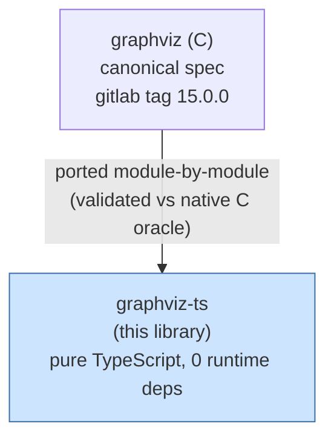
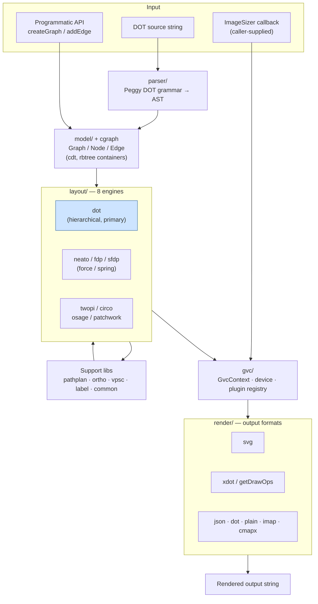

<!-- SPDX-License-Identifier: EPL-2.0 -->

# System Architecture

graphviz-ts is a single in-process library, not a distributed system. The
"architecture" is the rendering pipeline and its relationship to the upstream
spec. There are no network calls, data stores, or queues — the only external
seam is a caller-supplied image-sizing callback.

## Repo / dependency context

## Internal rendering pipeline

All communication is **synchronous, in-process function calls** — there is no
async, no IPC, no protocol. The pipeline below is what executes for a
`renderSvg(dot, engine)` call.

## Architectural notes

- **Communication style**: 100% synchronous in-process calls. `renderSvg` is
  self-contained — it constructs a fresh `Graph` and `GvcContext` per call, so
  multiple diagrams on one page are isolated (any new module-level mutable state
  must reset per render — a known invariant).
- **External dependencies**: none at runtime. The single I/O seam is
  `setImageSizer` — a callback the caller supplies so the library can learn an
  image's intrinsic dimensions without touching the filesystem.
- **Data stores**: none.
- **Plugin model**: `gvc/` mirrors Graphviz's plugin registry — the eight layout
  engines and the output-format devices register through `GvcContext`, matching
  the C architecture rather than introducing a new abstraction.
- **Fidelity boundary**: correctness is defined by the C source. The `dot`
  engine receives the most fidelity attention because downstream consumers
  are dot-centric.
