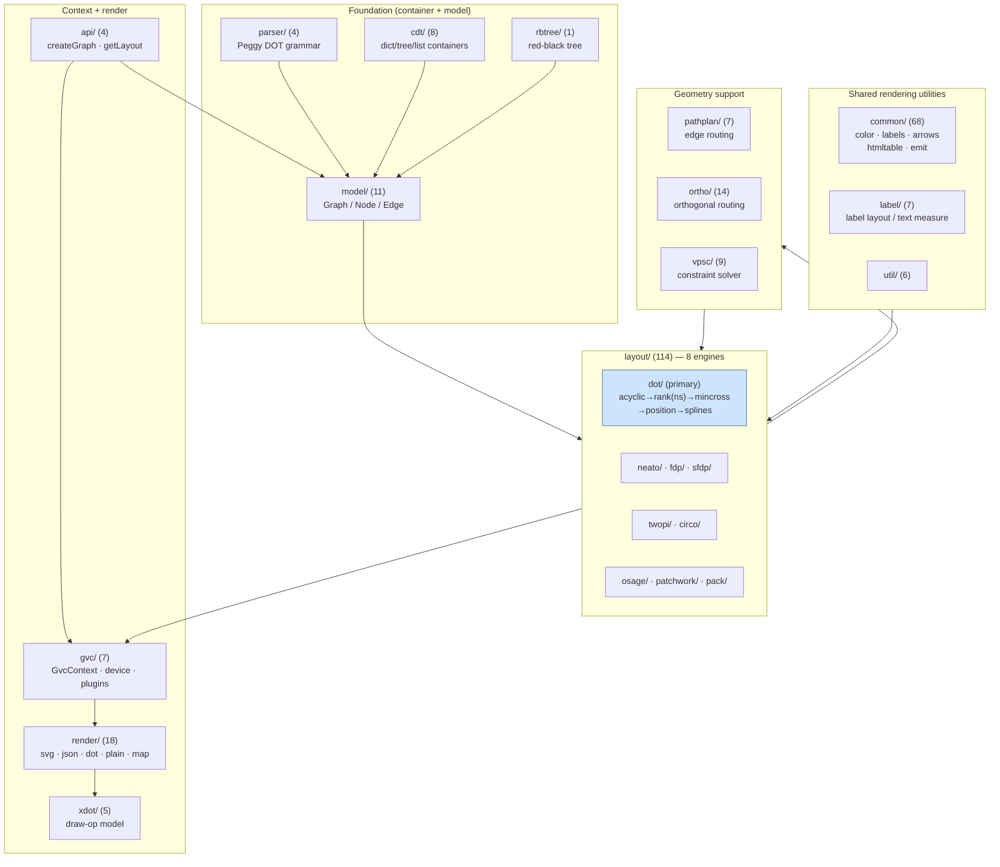
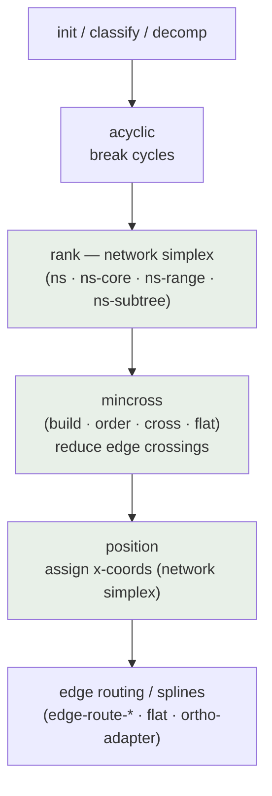
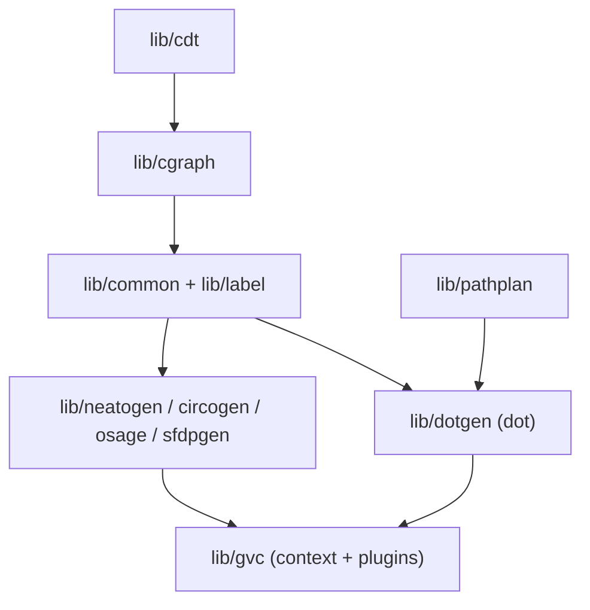

<!-- SPDX-License-Identifier: EPL-2.0 -->

# Component Diagrams

## graphviz-ts (this project)

`src/` mirrors the C Graphviz module layout. Porting proceeds bottom-up:
container types → graph model → shared rendering utilities → layout engines →
context/plugin layer → render. Non-test `.ts` file counts are shown per module.

### dot engine internal flow (the primary fidelity target)

## graphviz (C — spec, for reference)

The C module layout each TS module is ported from:

