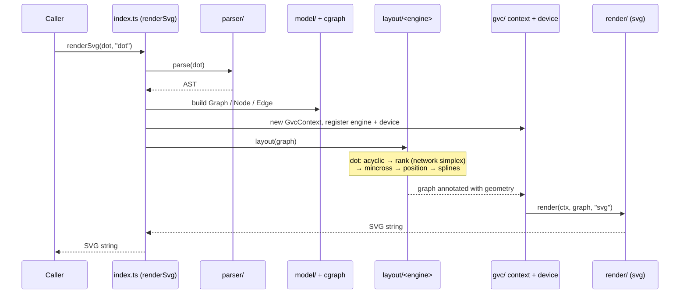
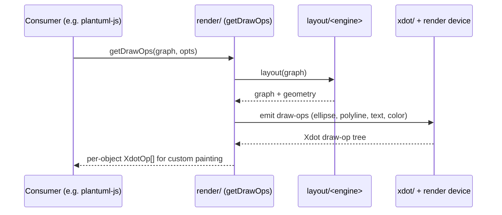

<!-- SPDX-License-Identifier: EPL-2.0 -->

# Data Flow — Sequence Diagrams

The three most important flows in graphviz-ts. All are synchronous, in-process,
and dependency-free.

## 1. DOT string → SVG (the primary flow)

`renderSvg(dotSource, engine)` is the headline entry point. The internal
pipeline mirrors C Graphviz: parse → model → layout → render.



`tryRenderSvg` wraps the same flow and returns a `RenderResult` instead of
throwing, so callers can handle `ParseError` / `RenderError` without a try/catch.

## 2. Programmatic graph → geometry snapshot

For callers that build graphs in code and want raw coordinates (e.g. to render
with their own backend). `getLayout()` requires `render()` to have run first —
there is no standalone layout pass; geometry is a side effect of rendering.

```mermaid
sequenceDiagram
    participant Caller
    participant Api as api/ (createGraph, addEdge)
    participant Render as render/ (render)
    participant Engine as layout/<engine>
    participant Geom as api/ (getLayout)

    Caller->>Api: createGraph(); addEdge(a, b)
    Api-->>Caller: Graph handle
    Caller->>Render: render(graph, "svg")
    Render->>Engine: layout(graph)
    Engine-->>Render: graph + geometry
    Render-->>Caller: rendered output
    Caller->>Geom: getLayout(graph)
    Note over Geom: reads computed geometry,<br/>flips Y-axis to screen coords,<br/>expands edge control points
    Geom-->>Caller: geometry snapshot (nodes, edges, points)
```

## 3. Layout → xdot draw operations

`getDrawOps()` exposes per-object draw operations so a consumer (e.g.
plantuml-js) can paint with a custom renderer instead of the built-in SVG
emitter. This is the integration seam by which graphviz-ts can replace
plantuml-js's in-house dot engine.


