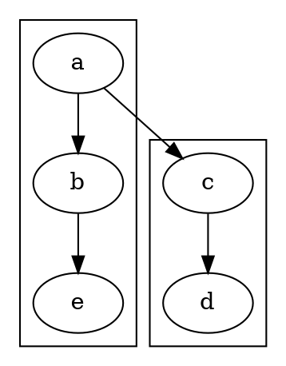

<!-- SPDX-License-Identifier: EPL-2.0 -->

# newrank cross-cluster `rank=same` routing — C trace and TS divergence

Repro:



Oracle (`GVBINDIR=/tmp/gvplugins ~/git/graphviz/build/cmd/dot/dot`):
`a=r0  b=r1  e=r2  c=r1(=b)  d=r2`. Node `c` (declared in **cluster1**)
reconciles to `b`'s rank because `{rank=same; b; c}` unions them.

**Symptom in the TS port:** with newrank enabled, node `c` is installed
**twice** into the root rank-1 array — once by the root `build_ranks`
pass and once by `cluster0`'s `expand_cluster` — producing an infinite
loop in `furthestNode` (`neighborNode` bounces `c`→`c`).

This document traces exactly how C avoids the double-install and pinpoints
the single TS line that diverges. All claims carry C `file:line` citations.
TS behaviour was confirmed with temporary instrumentation (now reverted).

---

## 1. Rank-set collapse across clusters (rank.c / class1.c)

Two distinct collapse machines exist, selected by the `newrank` attribute:

```
dot_rank(g):                                   // rank.c:522
    if (mapbool(agget(g,"newrank")))           // rank.c:523
        GD_flags(g) |= NEW_RANK; dot2_rank(g); // rank.c:524-525  ← THIS repro
    else
        dot1_rank(g);                          // rank.c:528
```

Because `newrank=true`, the **`dot2_rank`** path runs (rank.c:1071). It does
**not** use `collapse_rankset` / `cluster_leader` / `class1` at all — those
belong to the legacy `dot1_rank` path (rank.c:503-520, class1.c:63). Instead
`dot2_rank` builds a *separate constraint graph* `Xg`, ranks it with network
simplex, and reads the levels back onto the original nodes
(rank.c:1089-1106).

The `rank=same` union for newrank happens in **`compile_samerank`**:

- `compile_samerank` recurses over subgraphs (rank.c:650-651); for the
  `{rank=same; b; c}` subgraph `rankset_kind` returns `SAMERANK`
  (rank.c:568-585, 681).
- `SAMERANK` calls `union_all(ug)` (rank.c:682), which unions `b` and `c`
  through the **`ND_set` union-find** (rank.c:617-628, `find`/`union_one`).
  This is a *separate* union-find from the `dot1` `UF_*`/`ND_ranktype`
  machinery.
- Crucially, the union touches only `ND_set`. **Cluster membership
  (`ND_clust`) and `ND_ranktype` are NOT modified by the union.**

Cluster membership for newrank is assigned earlier in the same recursion:

```c
/* process this subgraph as a cluster */                 // rank.c:653
if (is_a_cluster(ug)) {
    for (n = agfstnode(ug); n; n = agnxtnode(ug, n)) {
        if (ND_clust(n) == 0)                            // rank.c:656
            ND_clust(n) = ug;                            // rank.c:657
    }
}
```

Because the loop iterates **each cluster's own node list** and only sets
`ND_clust` when still unset (rank.c:656), `b` gets `ND_clust = cluster0`
and `c` gets `ND_clust = cluster1`. **The union leader for the same-rank
set is just whichever of `b`/`c` is first in `ND_set`; it carries no cluster
authority and does not move `c` into cluster0.** Answer to Q1: union leader
is an `ND_set` representative only; `c` keeps `ND_ranktype = NORMAL(0)` and
`ND_clust = cluster1`; the union does **not** move `c`'s cluster membership.

---

## 2. Cluster collapse for ranking/mincross — the once-only install (class2.c / cluster.c / mincross.c)

After ranking, mincross runs. For **both** rank paths the cluster machinery
is shared and lives in `init_mincross → class2`:

```c
static void init_mincross(graph_t * g) {          // mincross.c:1022
    ...
    if (GD_flags(g) & NEW_RANK) fillRanks (g);     // mincross.c:1036-1037
    class2(g);                                     // mincross.c:1038
    ...
}
```

`class2` is where each cluster member is *marked* and *excluded from the
root node list*:

```c
void class2(graph_t * g) {                          // class2.c:155
    GD_nlist(g) = NULL;                             // class2.c:161
    mark_clusters(g);                              // class2.c:163
    for (c = 1; c <= GD_n_cluster(g); c++)
        build_skeleton(g, GD_clust(g)[c]);         // class2.c:164-165
    ...
    for (n = agfstnode(g); n; n = agnxtnode(g, n)) {
        if (ND_clust(n) == NULL && n == UF_find(n))// class2.c:175  ← KEY GUARD
            fast_node(g, n);                       // class2.c:176
        ...
    }
}
```

**`mark_clusters` sets the marks that the class2.c:175 guard reads:**

```c
void mark_clusters(graph_t * g) {                   // cluster.c:299
    for (n = agfstnode(g); n; n = agnxtnode(g, n)) {
        if (ND_ranktype(n) == CLUSTER) UF_singleton(n);
        ND_clust(n) = NULL;                        // cluster.c:307-310 (reset)
    }
    for (c = 1; c <= GD_n_cluster(g); c++) {
        clust = GD_clust(g)[c];
        for (n = agfstnode(clust); n; n = nn) {
            nn = agnxtnode(clust,n);
            if (ND_ranktype(n) != NORMAL) {        // cluster.c:317  ← NORMAL==0
                ... agdelete(clust,n); continue;   // cluster.c:318-322
            }
            UF_setname(n, GD_leader(clust));       // cluster.c:324
            ND_clust(n) = clust;                   // cluster.c:325
            ND_ranktype(n) = CLUSTER;              // cluster.c:326
        }
    }
}
```

`NORMAL` is `0` (const.h:24) and `ND_ranktype` is a `char` in a
calloc-zeroed struct (types.h:448), so for an untouched node
`ND_ranktype(n) == 0 == NORMAL`, the guard at cluster.c:317 is **false**,
and the body runs: `c` receives `ND_clust = cluster1` and
`ND_ranktype = CLUSTER`.

With those marks in place, the class2.c:175 guard `ND_clust(n) == NULL`
**excludes every cluster member (a,b,c,d,e) from the root `GD_nlist`**. The
root list instead contains only the cluster **skeleton rankleader** virtual
nodes built by `build_skeleton` (cluster.c:343-361: each rankleader gets
`ND_ranktype = CLUSTER`, `ND_clust = subg`).

The once-only install is then enforced in `build_ranks` + `install_cluster`:

```c
int build_ranks(graph_t *g, int pass) {             // mincross.c:1212
    ...
    if (ND_ranktype(n0) != CLUSTER) {              // mincross.c:1254
        install_in_rank(g, n0);                    // mincross.c:1255
        enqueue_neighbors(&q, n0, pass);
    } else {
        install_cluster(g, n0, pass, &q);          // mincross.c:1261
    }
}

int install_cluster(graph_t *g, node_t *n, int pass, node_queue_t *q) {
    clust = ND_clust(n);                            // cluster.c:384
    if (GD_installed(clust) != pass + 1) {         // cluster.c:385  ← once-guard
        for (r ...) install_in_rank(g, GD_rankleader(clust)[r]); // cluster.c:387
        for (r ...) enqueue_neighbors(q, GD_rankleader(clust)[r], pass);
        GD_installed(clust) = pass + 1;            // cluster.c:394
    }
}
```

So in the **root** `build_ranks`, a cluster node is never installed
directly — only its skeleton is, and `GD_installed` makes that idempotent
per pass. The interior nodes of a cluster are installed exactly once, later,
by that cluster's own `expand_cluster → build_ranks(subg)`
(cluster.c:280-296). Answer to Q2: exclusivity is enforced by the
`ND_clust(n)==NULL` guard at **class2.c:175** (cluster members never enter
the root nlist), backed by the `ND_ranktype==CLUSTER` dispatch
(mincross.c:1254) and the `GD_installed` skeleton guard (cluster.c:385).

---

## 3. Where the cross-cluster `rank=same` node actually lands

Trace `c` specifically:

- `c`'s `ND_clust = cluster1` is set in `mark_clusters` (cluster.c:325) —
  the per-cluster loop runs over `agfstnode(cluster1)` only, so `c` is
  attributed to **cluster1**, never cluster0.
- Because `ND_clust(c) != NULL`, class2.c:175 keeps `c` **out of the root
  `GD_nlist`**. The root's `GD_nlist` for `build_ranks` contains the
  cluster-skeleton rankleaders, plus any genuinely cluster-free node (none
  here).
- `c` is installed exactly once, by **cluster1's** `expand_cluster →
  build_ranks(cluster1)` (cluster.c:286). Cluster0's `build_ranks` iterates
  `cluster0`'s nlist (`a,b,e`) and **never sees `c`**.

Answer to Q3: after collapse, `c` lives only in `cluster1`'s build set.
In C, cluster0's `build_ranks` never sees `c`. The TS step that wrongly puts
`c` into cluster0's build set is the broken `mark_clusters` guard — see §4.

---

## 4. The TS divergence and the minimal faithful fix

### C-step → TS-port map

| C step | C cite | TS port |
| --- | --- | --- |
| `dot_rank` newrank gate | rank.c:523 | `dotRank` (`rank.ts:461`) |
| `compile_samerank` union + `ND_clust` | rank.c:630-700 | `compileSamerank` (`rank-dot2.ts:154`), `csProcessClusterNodes` (`rank-dot2.ts:133`) |
| `dot2_rank` constraint graph | rank.c:1071 | `dot2Rank` (`rank-dot2.ts:489`) |
| `init_mincross → class2` | mincross.c:1038 | `initMincross` (`mincross.ts:153`) |
| `mark_clusters` | cluster.c:299 | `markClusters` (`cluster.ts:226`) |
| `class2` root-nlist guard `ND_clust(n)==NULL` | class2.c:175 | `class2ProcessNodes` (`classify.ts:425-430`) |
| `build_ranks` / `install_cluster` | mincross.c:1212 / cluster.c:380 | `buildRanksBfs` (`mincross-build.ts:248`) / `installCluster` (`cluster.ts:380`) |

The TS ports of `compileSamerank`, `class2ProcessNodes`, `nodeInduce`, and
`installCluster` are all faithful. Instrumentation confirmed that at
`mark_clusters` time `cluster0.nodes = {a,b,e}` and `cluster1.nodes = {c,d}`
(membership is correct), and that the cluster-local `Node` objects are the
**same identity** as the root's (`agsubnode` shares the object —
`cgraph-ops.ts:114`), so a mutation to `n.info.clust` *would* propagate.

The single divergence is the `mark_clusters` "already-in-a-rankset" guard:

```ts
// src/layout/dot/cluster.ts:240-241  (markClusters)
for (const n of clust.nodes.values()) {
  if (n.info.ranktype !== 0) continue;   // ← BUG
  ...
  n.info.clust = clust;
  n.info.ranktype = CLUSTER;
}
```

C is `if (ND_ranktype(n) != NORMAL) continue;` with `NORMAL == 0`
(const.h:24) and `ND_ranktype` defaulting to `0` (calloc'd `char`,
types.h:448). In the TS port, `NodeInfo.ranktype` is **optional** and
defaults to **`undefined`** (`nodeInfo.ts:379` — `ranktype?: number`). For
an untouched NORMAL node `n.info.ranktype === undefined`, so
`undefined !== 0` is **`true`** and the loop **`continue`s past every
cluster member** — `n.info.clust`/`ranktype` are never assigned.

Downstream consequence (confirmed by instrumentation):

- All five nodes reach `class2ProcessNodes` with `clust === undefined`, so
  the class2.c:175-equivalent guard adds **all of them** (including `c`) to
  the **root** nlist via `fastNode` (`classify.ts:427`).
- The root `build_ranks` then installs `c` directly (`gName=""`), and
  `cluster0`'s `expand_cluster → build_ranks` *also* installs `c` (because
  cluster0's nlist was likewise mis-populated). → **double install → hang.**

### Verification (temporary, reverted)

Patching the guard to treat `undefined` as `0`:

```ts
if ((n.info.ranktype ?? 0) !== 0) continue;
```

made the trace match C exactly: `c.info.clust = cluster1`,
`addToRoot = false` for all members, the root nlist installed only the
cluster-skeleton rankleaders (name empty, `ranktype = 7 = CLUSTER`), `c`
installed **exactly once** by `cluster1`'s expand (not cluster0), no hang,
SVG rendered. (All source patches and the probe were reverted; this doc is
the only change.)

### The named minimal faithful fix

- **File / function:** `src/layout/dot/cluster.ts`, `markClusters`
  (cluster.ts:226, the guard at cluster.ts:241).
- **C behaviour TS dropped:** C's `ND_ranktype` defaults to `NORMAL == 0`
  (a zeroed `char`, const.h:24 / types.h:448), so the `mark_clusters`
  "already in a rankset" guard `if (ND_ranktype(n) != NORMAL) continue;`
  (cluster.c:317) lets every untouched NORMAL node through to be marked.
  The TS field `ranktype` is optional and defaults to `undefined`, so the
  literal `!== 0` comparison treats every untouched node as *already in a
  rankset* and skips it. The faithful change is to coerce the missing value
  to `NORMAL` (`(n.info.ranktype ?? 0) !== 0`, or better import/use the
  `NORMAL` constant from `fastgr.ts`), restoring C's "undefined == NORMAL ==
  0" invariant. (Optionally, the same `?? NORMAL` coercion belongs at the
  `mark_clusters` reset loop semantics and anywhere `ranktype` is compared
  to a literal, but the *single* load-bearing site for this bug is
  cluster.ts:241.)

### Write-set classification

The fix is at `src/layout/dot/cluster.ts` (function `markClusters`), which
**is INSIDE** the allowed write-set
`{rank.ts, rank-dot2.ts, mincross-build.ts(+split), mincross-order.ts,
mincross-utils.ts, cluster.ts, classify.ts, decomp.ts}`. No STOP trigger.

---

## Citations

- `lib/dotgen/cluster.c:317` — `if (ND_ranktype(n) != NORMAL) continue;` (the guard TS mis-ports)
- `lib/dotgen/cluster.c:325-326` — `ND_clust(n)=clust; ND_ranktype(n)=CLUSTER;`
- `lib/dotgen/class2.c:175-176` — `if (ND_clust(n)==NULL && n==UF_find(n)) fast_node(g,n);` (root-nlist exclusion)
- `lib/dotgen/cluster.c:384-394` — `install_cluster` `GD_installed` once-guard
- `lib/dotgen/mincross.c:1254-1261` — `ND_ranktype(n0)!=CLUSTER ? install_in_rank : install_cluster`
- `lib/common/const.h:24` — `#define NORMAL 0`
- `lib/common/types.h:448` — `char ranktype;` (calloc-zeroed default 0)
- `lib/dotgen/rank.c:653-657` — newrank `ND_clust` assignment in `compile_samerank`
