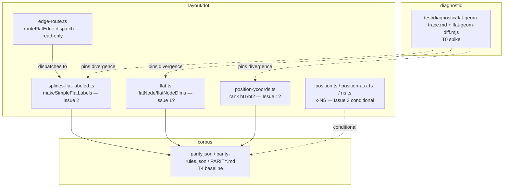

# Component map — affected files

```mermaid
graph TD
  subgraph layout/dot
    SFL[splines-flat-labeled.ts<br/>makeSimpleFlatLabels — Issue 2]
    FLAT[flat.ts<br/>flatNode/flatNodeDims — Issue 1?]
    PYC[position-ycoords.ts<br/>rank ht1/ht2 — Issue 1?]
    POS[position.ts / position-aux.ts / ns.ts<br/>x-NS — Issue 3 conditional]
    ER[edge-route.ts<br/>routeFlatEdge dispatch — read-only]
  end
  subgraph diagnostic
    DT[test/diagnostic/flat-geom-trace.md + flat-geom-diff.mjs<br/>T0 spike]
  end
  subgraph corpus
    PAR[parity.json / parity-rules.json / PARITY.md<br/>T4 baseline]
  end
  DT -.pins divergence.-> SFL
  DT -.pins divergence.-> FLAT
  DT -.pins divergence.-> PYC
  ER -->|dispatches to| SFL
  SFL --> PAR
  FLAT --> PAR
  PYC --> PAR
  POS -.conditional.-> PAR
```

C spec: `lib/dotgen/dotsplines.c` (makeSimpleFlatLabels), `lib/dotgen/flat.c`
(flat_node), `lib/dotgen/position.c` (set_ycoords).
