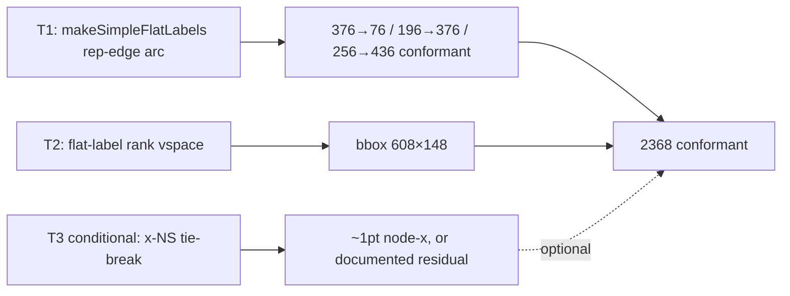

# Data flow — flat-labeled-edge routing + bbox

## Where the two residuals enter

```mermaid
flowchart TD
  A[dot_position] --> B[set_ycoords: rank ht1/ht2]
  B --> C[flat_edges → flatNode: label-vnode height]
  C -->|Issue 1: flat-label rank packs ~5pt tight| D[bbox 5pt short]
  A --> E[dot_splines_ → routeFlatEdge]
  E --> F{adjacent labeled flat?}
  F -->|yes| G[makeAdjFlatNoPortEdge → makeSimpleFlatLabels]
  G -->|Issue 2: rep edge installed as &#91;tp,tp,hp,hp&#93; straight| H[376→76 stub vs C arc]
  F -->|no, non-adjacent| I[makeFlatLabeledEdge channel]
  D --> J[gvPostprocess → SVG y-flip uses bbox height]
  H --> J
  J --> K[diverged: bbox 5pt + path 65pt]
```

## Fix targets

```mermaid
flowchart LR
  T1[T1: makeSimpleFlatLabels rep-edge arc] --> FixH[376→76 / 196→376 / 256→436 conformant]
  T2[T2: flat-label rank vspace] --> FixD[bbox 608×148]
  T3[T3 conditional: x-NS tie-break] --> FixX[~1pt node-x, or documented residual]
  FixH --> BM[2368 conformant]
  FixD --> BM
  FixX -.optional.-> BM
```
