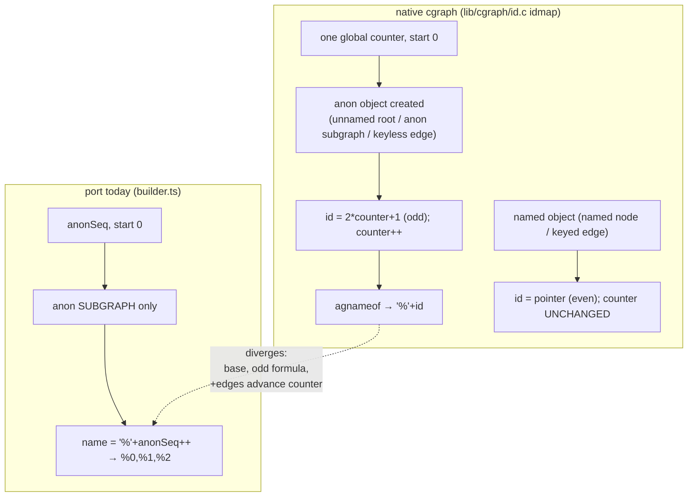

# Anonymous-id model (cgraph vs port)

Fix (Batch 2): replace `anonSeq` with a per-parse counter advanced in cgraph
creation order by anon root + anon subgraph + keyless edge; name `'%'+(2*counter+1)`.
