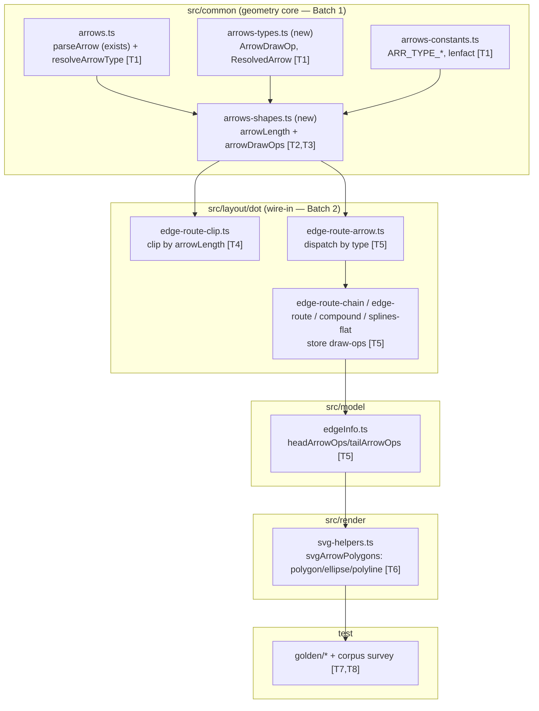

# Component map — modules touched

```mermaid
graph TD
  subgraph common["src/common (geometry core — Batch 1)"]
    AT["arrows.ts<br/>parseArrow (exists) + resolveArrowType [T1]"]
    AC["arrows-constants.ts<br/>ARR_TYPE_*, lenfact [T1]"]
    ATY["arrows-types.ts (new)<br/>ArrowDrawOp, ResolvedArrow [T1]"]
    AS["arrows-shapes.ts (new)<br/>arrowLength + arrowDrawOps [T2,T3]"]
  end
  subgraph layout["src/layout/dot (wire-in — Batch 2)"]
    CLIP["edge-route-clip.ts<br/>clip by arrowLength [T4]"]
    ARW["edge-route-arrow.ts<br/>dispatch by type [T5]"]
    SITES["edge-route-chain / edge-route / compound / splines-flat<br/>store draw-ops [T5]"]
  end
  subgraph model["src/model"]
    EI["edgeInfo.ts<br/>headArrowOps/tailArrowOps [T5]"]
  end
  subgraph render["src/render"]
    SVG["svg-helpers.ts<br/>svgArrowPolygons: polygon/ellipse/polyline [T6]"]
  end
  subgraph tests["test"]
    G["golden/* + corpus survey [T7,T8]"]
  end

  AT --> AS
  ATY --> AS
  AC --> AS
  AS --> CLIP
  AS --> ARW
  ARW --> SITES
  SITES --> EI
  EI --> SVG
  SVG --> G
```
