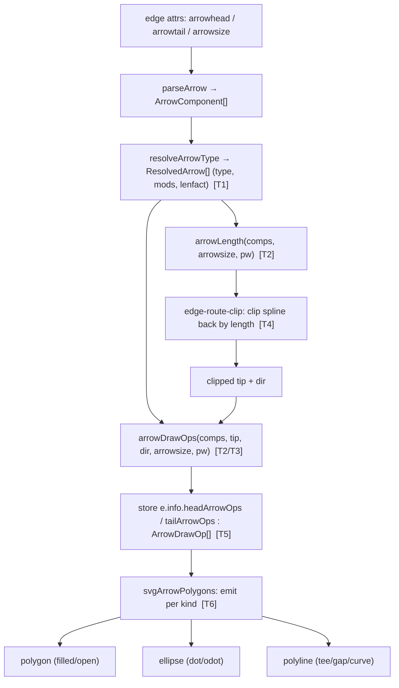
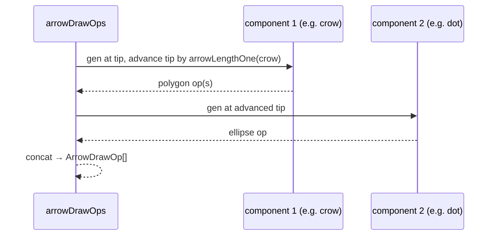

# Data flow — arrowhead geometry

## Per-arrow emission (compound stacking)

> C computes arrows at render (`arrow_gencode`); the port computes at layout and
> stores `ArrowDrawOp[]` on `e.info` (ADR-2). Clip length (T4) and shape (T5) use
> the SAME per-type math so the tip and the drawn shape stay consistent.
