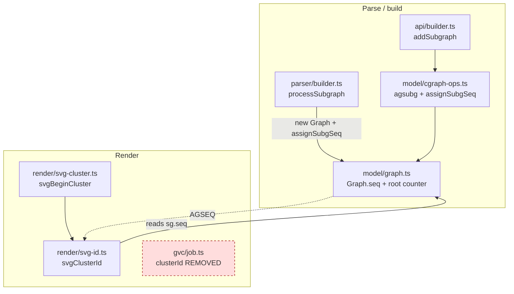

<!-- SPDX-License-Identifier: EPL-2.0 -->

# Component map

`Graph.seq` (T1) is the single contract; both creation paths write it via
`assignSubgSeq`, and `svgClusterId` (T2) reads it. `job.clusterId` is deleted.
