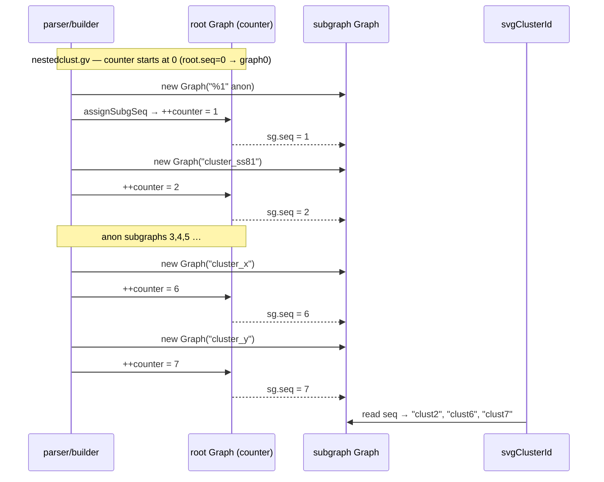

<!-- SPDX-License-Identifier: EPL-2.0 -->

# Data flow — AGSEQ assignment vs C

Mirrors C: `agnextseq(par, AGRAPH)` = `++clos->seq[AGRAPH]` (graph.c:152),
assigned when the subgraph opens, before its body recurses.
