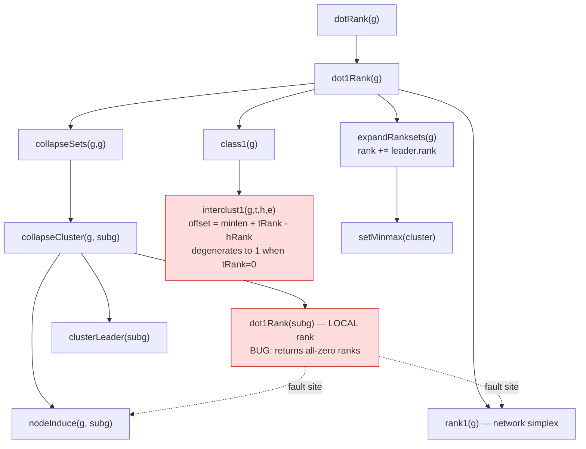

# Component map — cluster ranking call chain

Faithful (verified): `class1`, `interclust1`, `clusterLeader`, `setMinmax`,
`expandNode`. Defect: `dot1Rank(subg)` produces no local ranks, starving
`interclust1`'s offset.
