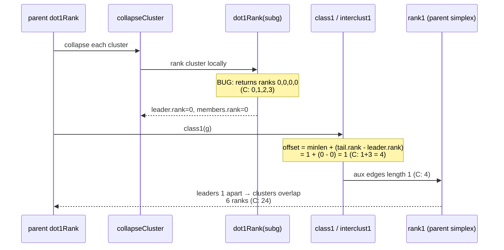

# Data flow — why clusters fail to stack

```mermaid
sequenceDiagram
  participant P as parent dot1Rank
  participant CC as collapseCluster
  participant SUB as dot1Rank(subg)
  participant C1 as class1 / interclust1
  participant R as rank1 (parent simplex)

  P->>CC: collapse each cluster
  CC->>SUB: rank cluster locally
  Note over SUB: BUG: returns ranks 0,0,0,0<br/>(C: 0,1,2,3)
  SUB-->>CC: leader.rank=0, members.rank=0
  P->>C1: class1(g)
  Note over C1: offset = minlen + (tail.rank - leader.rank)<br/>= 1 + (0 - 0) = 1  (C: 1+3 = 4)
  C1->>R: aux edges length 1 (C: 4)
  R-->>P: leaders 1 apart → clusters overlap<br/>6 ranks (C: 24)
```

After T1: `SUB` returns `0,1,2,3` → offset `4` → leaders stack → 24 ranks == C.
