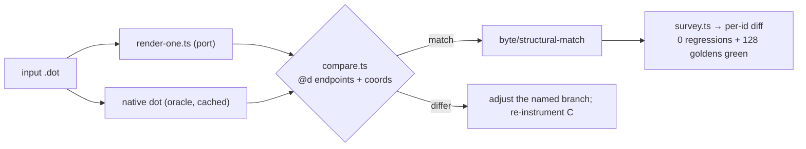

# Compass-port routing — data flow

## Where a compass-port edge endpoint is decided

```mermaid
flowchart TD
  A["parse: node2:sw → port {side, compass}"] --> B["compassPort<br/>src/common/compass-port.ts<br/>(C shapes.c:compassPort)"]
  B --> C["port.p offset = compass point on node boundary"]
  C --> D["begin/endpath<br/>splines-path-shared.ts / splines-path-end.ts<br/>(C splines.c beginpath/endpath)"]
  D --> E1["regular edge: routing boxes<br/>edge-route-boxes.ts / edge-route-faithful.ts"]
  D --> E2["flat (same-rank) edge: flat box<br/>splines-flat.ts (C make_flat_edge)"]
  E1 --> F["routeSplines → ED_spl control points"]
  E2 --> F
  F --> G['emit: svgEdgePath → d="M.. C.."']
  C -. "DIVERGENCE candidate: wrong compass point" .-> C
  D -. "DIVERGENCE candidate: wrong endpoint/box" .-> D
```

T1 (regular, #2168) and T2 (flat, #241_0) each dump C vs port at B/D/E to pin
the FIRST divergence — the fix target.

## Verification loop (per input, per task)


