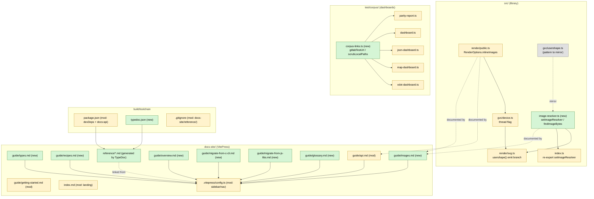

<!-- SPDX-License-Identifier: EPL-2.0 -->
# Component map

What the mission touches and how the pieces relate. Green = new, yellow =
modified, grey = read-only context.

## Ownership (one writer per file)

| File(s) | Owner |
|---|---|
| `src/gvc/image-resolver.ts`(+test), `src/render/svg.ts`, `src/render/public.ts`, `src/gvc/device.ts`, `src/index.ts` | T1 |
| `test/corpus/corpus-links.ts`(+test), `parity-report.ts`, `dashboard.ts`, `json-dashboard.ts`, `map-dashboard.ts`, `xdot-dashboard.ts` | T2 |
| `package.json`, `typedoc.json`, `.gitignore` | T3 |
| `src/api/edge-ops.ts`, `src/render/xdot-public.ts`, `src/api/index.ts`, `src/render/index.ts` | T4 |
| `docs-site/guide/types.md` | T5 |
| `docs-site/guide/recipes.md` | T6 |
| `docs-site/guide/images.md` | T7 |
| `docs-site/guide/overview.md` | T8 |
| `docs-site/guide/migrate-from-c-cli.md`, `migrate-from-js-libs.md` | T9 |
| `docs-site/guide/glossary.md` | T10 |
| `docs-site/guide/api.md` | T11 |
| `docs-site/.vitepress/config.ts`, `docs-site/index.md`, `docs-site/guide/getting-started.md` | T12 |
