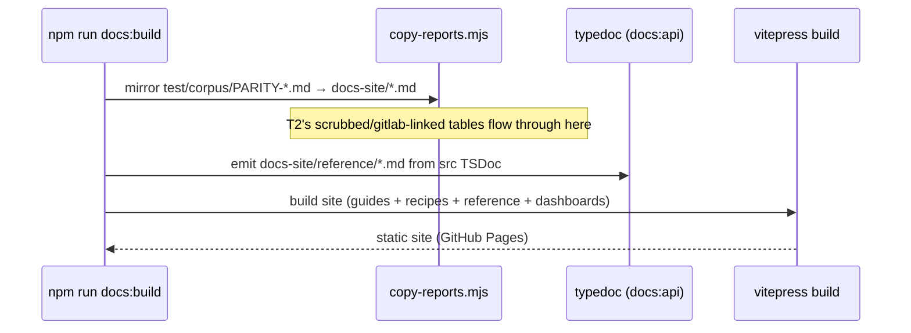
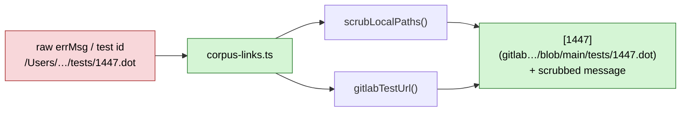

<!-- SPDX-License-Identifier: EPL-2.0 -->
# Data-flow diagrams

## 1. Image inlining (T1)

The default path is unchanged (verbatim href). The `inlineImages` flag adds
one branch that consults the global resolver and rewrites the href to a
`data:` URI. Default-off output is byte-identical.

```mermaid
sequenceDiagram
  participant App as Caller
  participant R as render(g, 'svg', opts)
  participant J as RenderJob
  participant S as svg.ts usershape(src, box)
  participant IR as image-resolver (global)

  App->>IR: setImageResolver(src => bytes|null)
  App->>R: render(g, 'svg', { inlineImages: true })
  R->>J: create job (inlineImages = true)
  J->>S: emit <image> for node image= / 
  alt inlineImages && resolver hit
    S->>IR: findImageBytes(src)
    IR-->>S: { bytes, mime }
    S->>S: base64(bytes) (browser-safe)
    S-->>J: <image xlink:href="data:mime;base64,…">
  else default (flag off or miss)
    S-->>J: <image xlink:href="src">  %% unchanged
  end
```

## 2. Docs build (T3 + T12 + copy-reports)



## 3. Dashboard link hygiene (T2)


