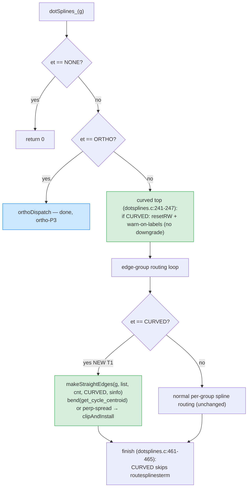
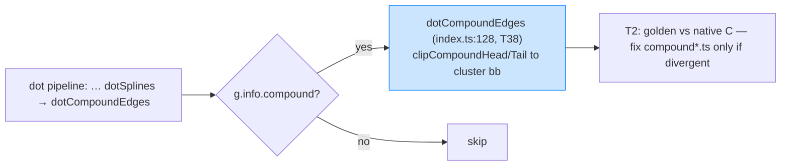

# Curved dispatch + compound pass (vs C)

## Where curved plugs in (mirrors dotsplines.c)

## Compound (already wired — T2 verifies)

Blue = already implemented. Green = new in this mission (T1). T2 mints native-C
goldens for both and fixes the TS to match C on any divergence.
