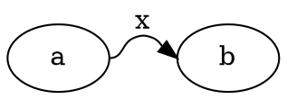

# Comparison — DOT-11a: labeled ported flat spline

## Input



## Oracle (dot 15.0.0)

```
M54,-18C62.13,-18 60.91,-26.42 68.62,-29 71.47,-29.95 72.53,-29.95 75.38,-29 78.03,-28.11 79.62,-26.54 80.91,-24.85
```

## Port (this branch, after T1)

`renderSvg(...)` emits the identical 10-point spline within 0.5pt.

## Verdict

**MATCH** (byte-format tolerance). Before T1, `repositionFlatAux` iterated
the named-node Map and skipped the aux graph's virtual nodes, so the spline
bent wider (`C64.24,-18 64.32,-26.48 74.25,-29...`). Iterating `nlist`
(C's `GD_nlist`) repositions the virtual label + routing nodes to `midx`,
restoring byte-exactness. No-label ported flat stays byte-identical
(`M54,-18C56.75,-18 58.79,-18 60.61,-18`). Full suite 1855 passed, zero
golden churn. Pinned by `splines-flat.test.ts` → "DOT-11a".
