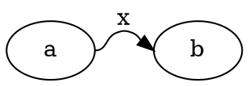

# Comparison — DOT-12 + DOT-10: port-bearing labeled flat label

## Input

## Oracle (dot 15.0.0)

`~/git/graphviz/build/cmd/dot/dot -Tsvg`, GVBINDIR=/tmp/gvplugins.
- label `<text>x</text>` at **(72, −32.91)**
- spline `M54,-18C62.13,-18 60.91,-26.42 68.62,-29 71.47,-29.95 72.53,-29.95 75.38,-29 78.03,-28.11 79.62,-26.54 80.91,-24.85`

## Port (this branch, after T1 + T2)

`renderSvg(...)` emits `<text>x</text>` at **(72, −32.91)** within 0.5pt,
and the spline matches byte-for-byte (DOT-11a, prior mission).

## Verdict

**MATCH** (≤0.5pt). Before this mission the label was dropped, and the
prior two attempts mislaid it by ~26pt. Root cause (C-instrumented):
`recover_slack` (`dotsplines.c:2054`, called in `make_regular_edge`)
repositions the aux label vnode onto the routed spline (x 33→11.71); TS
never ported it. T1 ports `recover_slack`/`resize_vn` into the multi-rank
router and re-places the aux labels after routing; T2 copies the label
back (`copyFlatLabel`). Pinned by `splines-flat.test.ts` → "DOT-12 +
DOT-10". Full suite 1856 passed, zero golden churn.

## C ground truth (aux label vnode, validated via plugin instrumentation)

| Stage | C | TS (after fix) |
|---|---|---|
| post-position | (33, 66.38) | (51, …) |
| after recover_slack | (11.71, 45) | (29.71, 72) |
| label.pos post-postproc | (87.75, 37.96) | (60.75, **37.96**) |
| final label | (72, −32.91) | **(72, −32.91)** |

The aux x/y offsets (+18 aux, +27 main, from normalization timing) are
absorbed by `del` in the copy-back, exactly as for the spline.
