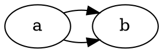

# Comparison — DOT-9: unlabeled parallel adjacent flats

## Input



## Oracle (dot 15.0.0)

`~/git/graphviz/build/cmd/dot/dot -Tsvg`, GVBINDIR=/tmp/gvplugins.
Two distinct fanned splines (one above, one below the rank line):

```
M48.66,-6.64  C54.49,-4.9  60.32,-4.22  66.15,-4.6
M48.66,-29.36 C54.49,-31.1 60.32,-31.78 66.15,-31.4
```

## Port (graphviz-ts, this branch)

`renderSvg('digraph{ {rank=same; a b} a->b; a->b }', 'dot')` emits two
4-point splines matching both oracle control-point lists within 0.5pt
(order-independent), via `makeSimpleFlat` (`splines-flat-labeled.ts`).

## Verdict

**MATCH** (≤0.5pt, byte-format tolerance). Before this task the group
fell back to the simplified fitter and the two flats overlapped as a
single line. Pinned by
`splines-flat-labeled.test.ts` → "DOT-9 — unlabeled parallel adjacent
flats (makeSimpleFlat) vs dot 15.0.0". Full suite 1853 passed, all
unrelated goldens byte-identical (single unlabeled flats unchanged).
