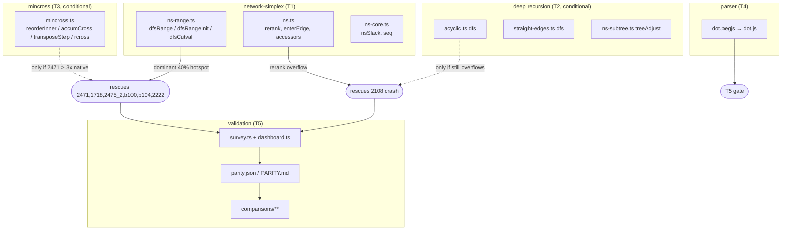

<!-- SPDX-License-Identifier: EPL-2.0 -->

# Component map

Files touched, by subsystem, and which task owns each.

## Ownership (one writer per file)

| File | Task |
|---|---|
| ns-range.ts, ns.ts, ns-core.ts | T1 |
| acyclic.ts, straight-edges.ts, ns-subtree.ts | T2 |
| mincross.ts (+ mincross-*.ts) | T3 |
| parser/dot.pegjs, parser/dot.js | T4 |
| corpus/parity.json, PARITY.md, comparisons/** | T5 |

No two concurrent tasks share a file. T1∥T4 (batch-1); T2∥T3 (batch-2); T5 alone.
