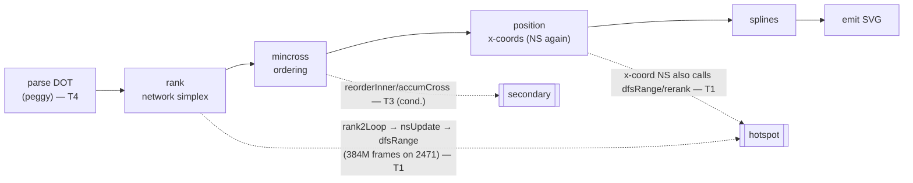
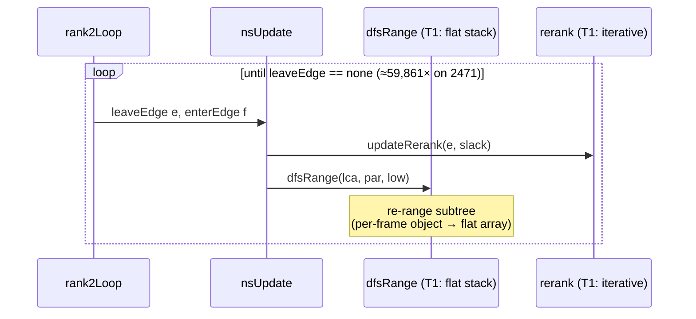

<!-- SPDX-License-Identifier: EPL-2.0 -->

# Data flow

## Where the hotspot lives in the dot pipeline

`dfsRange` is invoked from `nsUpdate` (`ns.ts:251`) on every simplex pivot, in
**both** the y-rank pass and the x-coordinate pass (the aux graph). That is why
it dominates: pivots × subtree-size = 384M frame-steps on 2471.

## Network-simplex pivot loop (the hot loop)

The fix changes only **how** `dfsRange` stores its traversal frames and **how**
`rerank` recurses — never the loop count, pivot order, or computed ranks. Output
SVG is byte-identical; the survey gate (AD-4) enforces this.
