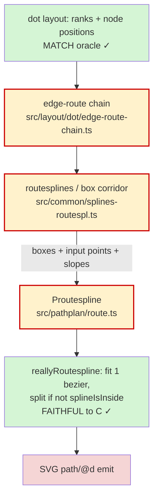

<!-- SPDX-License-Identifier: EPL-2.0 -->

# Component map — edge spline routing

Green = verified matching the oracle. Yellow + red border = the suspect upstream
zone S1 must bisect (box corridor / input chain / endpoint slopes). Red = the
observable divergence (extra bezier piece in `path/@d`).
