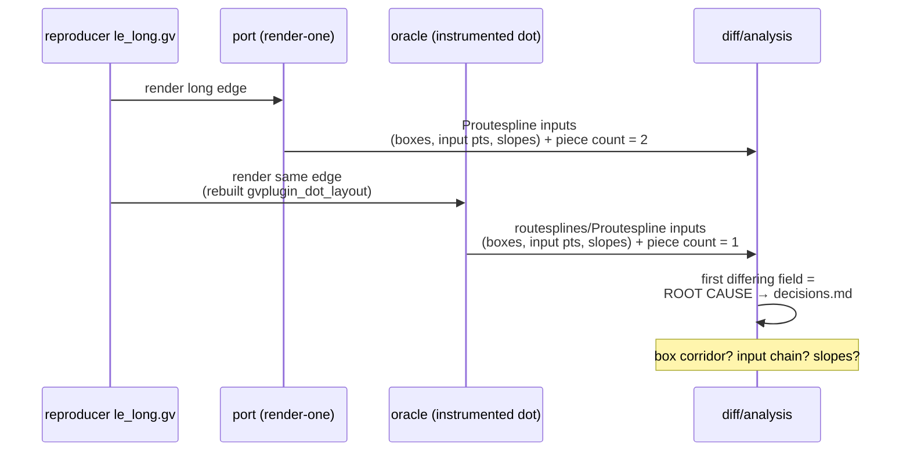

<!-- SPDX-License-Identifier: EPL-2.0 -->

# Data flow — S1 localization spike

The piece-count difference (port 2 vs oracle 1) is downstream of whichever input
field differs first. S1 bisects boxes → input points → slopes in that order.
