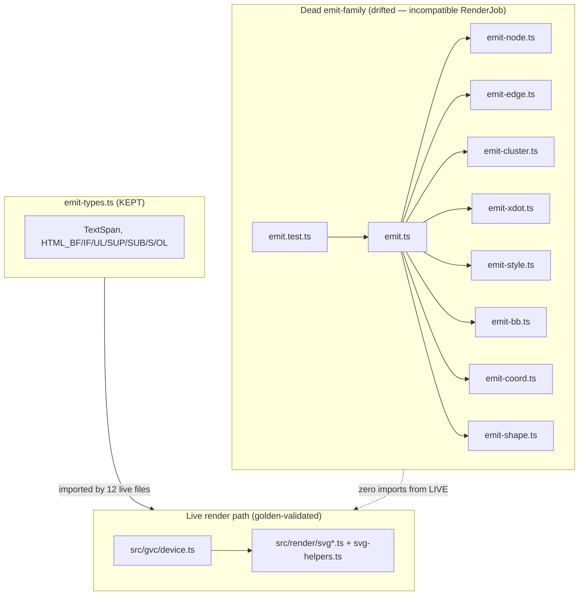
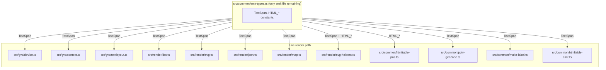
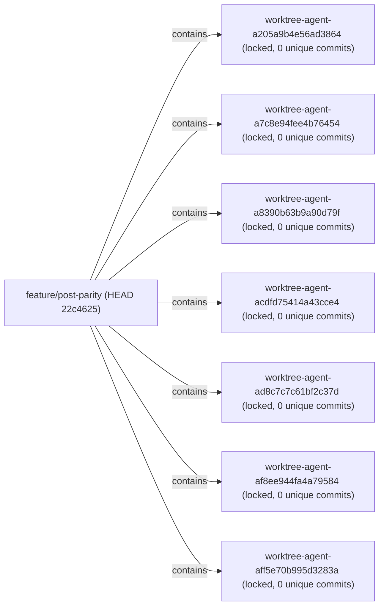

# Component map — emit-family cleanup

## Before deletion (pre-`a785a86`)

## After deletion (current state on `feature/post-parity`)

## Worktrees (pre-cleanup)

Each worktree still holds the pre-deletion emit-family files in its
`.claude/worktrees/agent-*/src/common/` directory. T2 removes them.
