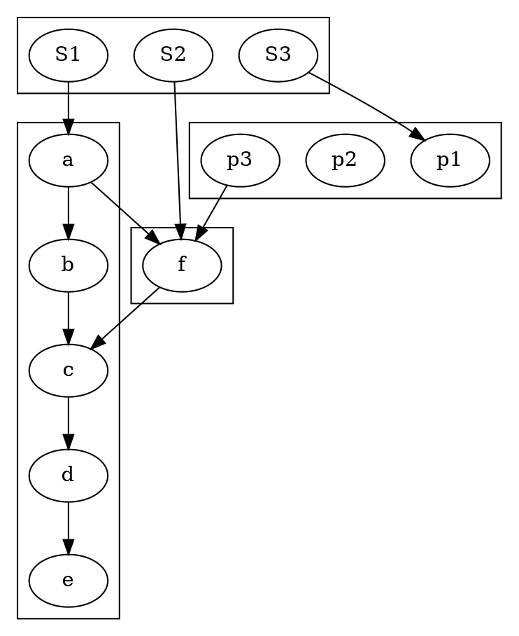

<!-- SPDX-License-Identifier: EPL-2.0 -->
# Deferred: 1767.dot (RC3 re-classified)

## Status: deferred to the cluster-membership derisk mission (user-confirmed 2026-06-22)

RC3 in the brief was "`buildSkeletonEdgeCounts` null `rankleader[r]`/`.out`",
scoped to `cluster.ts`. The crash is real, but its root cause is **not** in
`build_skeleton`'s count logic — it is upstream **cluster node/edge membership +
ranking**, the same infrastructure class as the deferred RC2 cases (1332, b53).

## The input (overlapping clusters)

Nodes are referenced in multiple clusters. In dot, a node belongs to the **first**
cluster it appears in: `a,c`→cluster_0, `f`→cluster_1, `p1,p2,p3`→cluster_2.

## Native C ground truth vs port (instrumented `build_skeleton`)

| Cluster | C (native, owned-only) | Port (leaks foreign nodes) |
|---------|------------------------|----------------------------|
| cluster_0 | `a:1,b:2,c:3,d:4,e:5` | `a:1,b:2,c:3,d:4,e:5` ✓ |
| cluster_1 | `f:2` | `a:1, f:3, c:3` ✗ |
| cluster_2 | `p1:1, p2:1, p3:1` | `p1:1, p2:0, p3:0, f:3` ✗ |
| cluster_3 | `S1:0, S2:0, S3:0` | (crash before reached) |

Two divergences:
1. **Membership** — the port keeps foreign nodes (`a`,`c` in cluster_1; `f` in
   cluster_2) that C excludes. `build_skeleton` then does
   `rankleader[ND_rank(f)=3]` for cluster_2 (bounds `[0,1]`) → undefined → crash.
   C never iterates the foreign edge `f->c` (c∉cluster_1), so it never hits an
   empty leader.
2. **Ranking** — the rank=same cluster_2 members are not all at one rank in the
   port (`p2:0,p3:0,p1:1`), and `f` is rank 3 vs C's 2.

## Real (faithful) fix found in passing — for the derisk mission

`buildSkeletonEdgeCounts` (cluster.ts) has a genuine divergence independent of
membership: it bumps `rankleader[r].out[0].count` for **each** `r` in the span,
but C bumps a **fixed** `rl = GD_rankleader(subg)[ND_rank(v)]` once per iteration
(`cluster.c:build_skeleton`). This fix alone does not render 1767 (membership is
the dominant cause) and was reverted to keep the tree clean; re-apply it inside
the derisk mission alongside the membership fix.

## Why deferred

Per ADR-1 the fix must be a faithful C port, not a guard. The membership/ranking
fix is upstream of `build_skeleton`, cross-module (cluster install, `class2`,
ranking), and outside every task's write-set. Per the autonomous STOP rules
(mis-scope + out-of-write-set) and the user's pivot, RC3 is moved to the derisk
mission.

## Net outcome

`errored` → still `errored`, but the root cause is now precisely characterized
(membership + ranking, with C ground truth dumped) and a real secondary
`build_skeleton` bug is documented for the follow-on.
