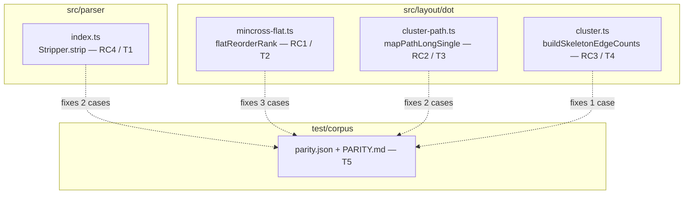

<!-- SPDX-License-Identifier: EPL-2.0 -->
# Modules touched

```mermaid
graph TD
  subgraph parser [src/parser]
    IDX["index.ts<br/>Stripper.strip — RC4 / T1"]
  end
  subgraph layout [src/layout/dot]
    MF["mincross-flat.ts<br/>flatReorderRank — RC1 / T2"]
    CP["cluster-path.ts<br/>mapPathLongSingle — RC2 / T3"]
    CL["cluster.ts<br/>buildSkeletonEdgeCounts — RC3 / T4"]
  end
  subgraph corpus [test/corpus]
    PJ["parity.json + PARITY.md — T5"]
  end

  IDX -. "fixes 2 cases" .-> PJ
  MF  -. "fixes 3 cases" .-> PJ
  CP  -. "fixes 2 cases" .-> PJ
  CL  -. "fixes 1 case"  .-> PJ
```

Disjoint write-sets (one file per task). T5 reads the survey output only. Oracle
= native `dot` 15.1.0, used to instrument RC1–3.
