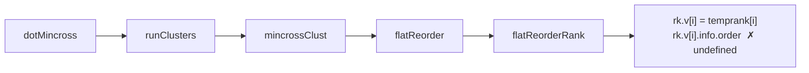
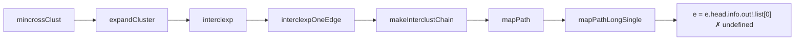
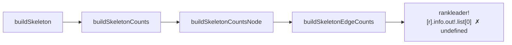
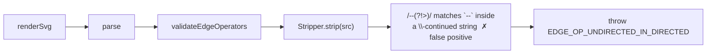

<!-- SPDX-License-Identifier: EPL-2.0 -->
# Crash paths per root cause

Each chain ends at the throwing line. RC1–3 are layout-phase null-derefs; RC4 is
a pre-parse heuristic false-positive.

## RC1 — flatReorderRank temprank undercount (121, 2239, 258)

## RC2 — mapPathLongSingle null-head walk (1332, graphs-b53)

## RC3 — buildSkeletonEdgeCounts null rankleader/out (1767)

## RC4 — Stripper leaks in-string `--` (graphs-big, graphs-biglabel)

