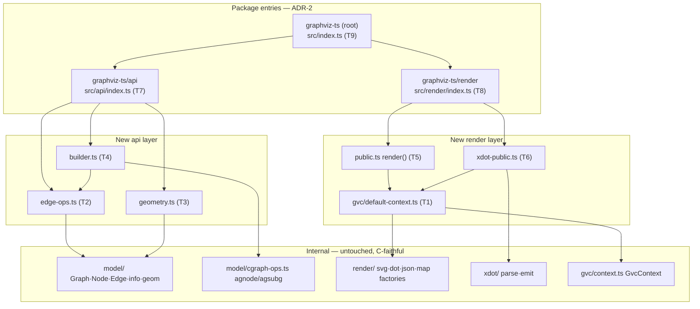

# Component map

New public layer (green) over untouched internals (grey). Arrows = "depends on".

Only `src/index.ts` and `package.json` are **modified** (T9). Everything else in
the new layers is **created**. Internals are read-only for this mission.
