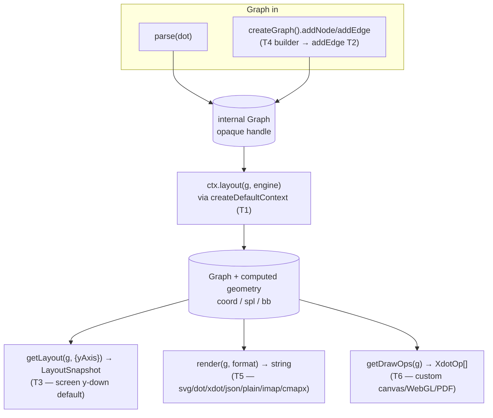
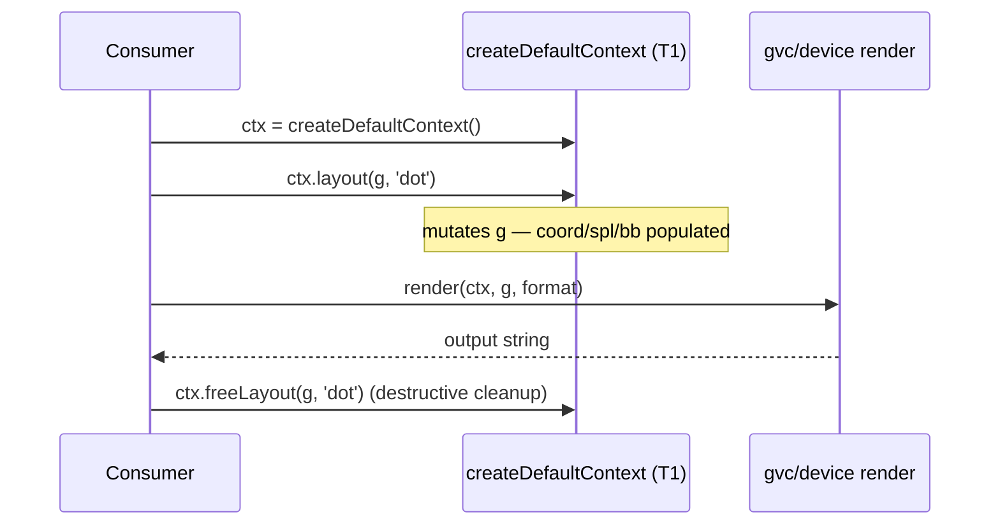

# Data flow

How a consumer reaches each new capability. Two ways in (parse or build), one
layout phase, three ways out (geometry snapshot, format string, draw-ops).

```mermaid
flowchart TD
  subgraph IN[Graph in]
    P["parse(dot)"]
    B["createGraph().addNode/addEdge<br/>(T4 builder → addEdge T2)"]
  end
  P --> G[(internal Graph<br/>opaque handle)]
  B --> G
  G --> L["ctx.layout(g, engine)<br/>via createDefaultContext (T1)"]
  L --> GG[(Graph + computed geometry<br/>coord / spl / bb)]
  GG --> OUT1["getLayout(g, {yAxis}) → LayoutSnapshot<br/>(T3 — screen y-down default)"]
  GG --> OUT2["render(g, format) → string<br/>(T5 — svg/dot/xdot/json/plain/imap/cmapx)"]
  GG --> OUT3["getDrawOps(g) → XdotOp[]<br/>(T6 — custom canvas/WebGL/PDF)"]
```

## Layout-as-a-phase detail

```mermaid
sequenceDiagram
  participant C as Consumer
  participant Ctx as createDefaultContext (T1)
  participant Dev as gvc/device render
  C->>Ctx: ctx = createDefaultContext()
  C->>Ctx: ctx.layout(g, 'dot')
  Note over Ctx: mutates g — coord/spl/bb populated
  C->>Dev: render(ctx, g, format)
  Dev-->>C: output string
  C->>Ctx: ctx.freeLayout(g, 'dot')  (destructive cleanup)
```
