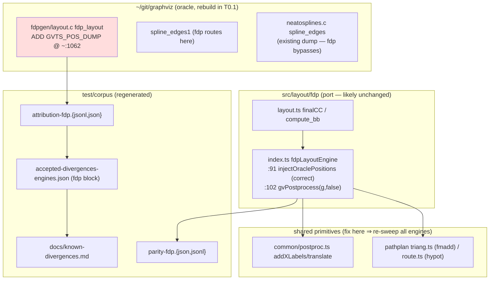

# Component map — fdp mission

**Fix-locus by bucket:**
- B1 (frame) → `src/layout/fdp/{index,layout}.ts` and/or `common/postproc.ts`
  (shared — re-sweep all engines).
- B2 (drift) → no code (A1-drift class, computed).
- B3 (FP-tie) → no code expected (levers applied); accept A9.
