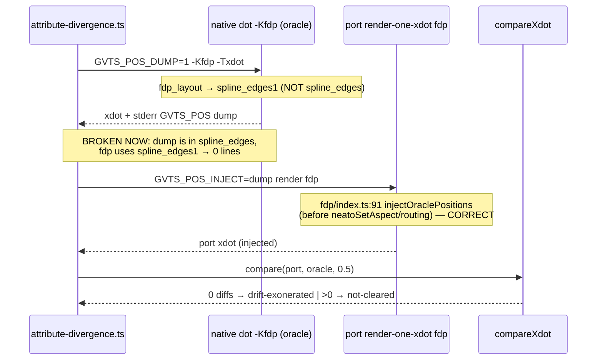
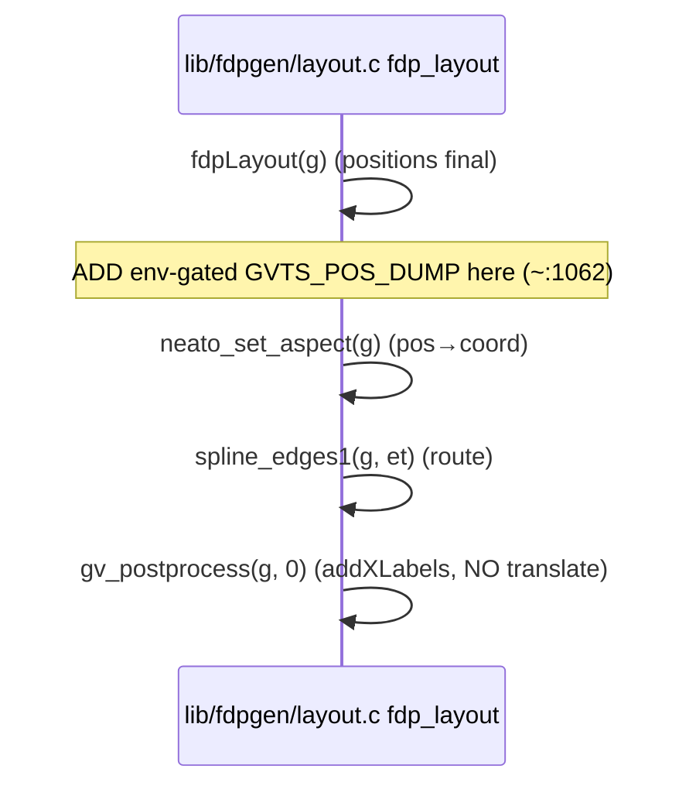

# Data flow — fdp injection-attribution

## The injection harness (why fdp injection is currently broken)

```mermaid
sequenceDiagram
    participant H as attribute-divergence.ts
    participant O as native dot -Kfdp (oracle)
    participant P as port render-one-xdot fdp
    participant C as compareXdot

    H->>O: GVTS_POS_DUMP=1 -Kfdp -Txdot
    Note over O: fdp_layout → spline_edges1 (NOT spline_edges)
    O-->>H: xdot + stderr GVTS_POS dump
    Note over O,H: BROKEN NOW: dump is in spline_edges,<br/>fdp uses spline_edges1 → 0 lines
    H->>P: GVTS_POS_INJECT=dump render fdp
    Note over P: fdp/index.ts:91 injectOraclePositions<br/>(before neatoSetAspect/routing) — CORRECT
    P-->>H: port xdot (injected)
    H->>C: compare(port, oracle, 0.5)
    C-->>H: 0 diffs → drift-exonerated | >0 → not-cleared
```

## Batch 0 fix (T0.1): add the dump at fdp's site, rebuild

```mermaid
sequenceDiagram
    participant L as lib/fdpgen/layout.c fdp_layout
    L->>L: fdpLayout(g)  (positions final)
    Note over L: ADD env-gated GVTS_POS_DUMP here (~:1062)
    L->>L: neato_set_aspect(g)  (pos→coord)
    L->>L: spline_edges1(g, et)  (route)
    L->>L: gv_postprocess(g, 0)  (addXLabels, NO translate)
```
