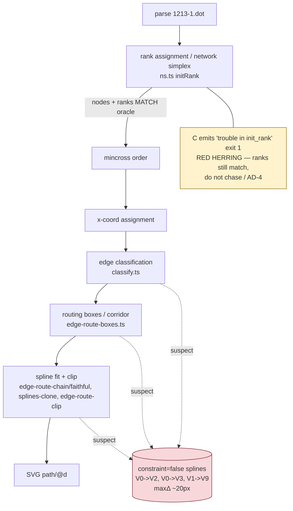

<!-- SPDX-License-Identifier: EPL-2.0 -->
# Component map — 1213 constraint=false spline divergence

Pipeline stages a `constraint=false` edge passes through, and where the divergence is
suspected (Batch 1 pins the exact one).

Established pre-mission: stages A–D produce identical output to the oracle (node
positions byte-identical). The divergence is isolated to E/F/G for the three
`constraint=false` edges only. Batch 1 (T1) determines which of E/F/G is the origin.
