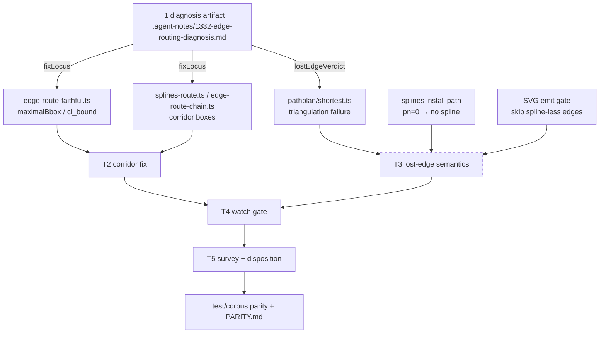

<!-- SPDX-License-Identifier: EPL-2.0 -->
# Component map — files in play

Dashed = conditional (D1 rung 2 only). C references:
`lib/dotgen/dotsplines.c` (boxes/pathend), `lib/common/routespl.c`
(polygon + error path), `lib/pathplan/shortest.c` (failure site).
