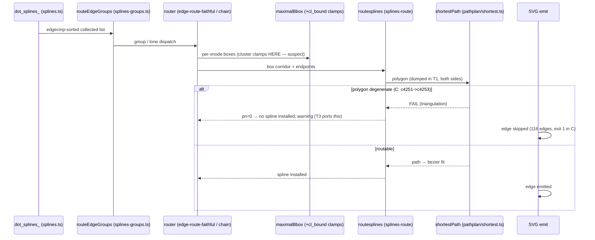

<!-- SPDX-License-Identifier: EPL-2.0 -->
# Data flow — cluster edge routing (the phase under diagnosis)

```mermaid
sequenceDiagram
    participant DS as dot_splines_ (splines.ts)
    participant GG as routeEdgeGroups (splines-groups.ts)
    participant RT as router (edge-route-faithful / chain)
    participant MB as maximalBbox (+cl_bound clamps)
    participant RS as routesplines (splines-route)
    participant SP as shortestPath (pathplan/shortest.ts)
    participant EM as SVG emit

    DS->>GG: edgecmp-sorted collected list
    GG->>RT: group / lone dispatch
    RT->>MB: per-vnode boxes (cluster clamps HERE — suspect)
    RT->>RS: box corridor + endpoints
    RS->>SP: polygon (dumped in T1, both sides)
    alt polygon degenerate (C: c4251->c4253)
        SP-->>RS: FAIL (triangulation)
        RS-->>RT: pn=0 → no spline installed, warning (T3 ports this)
        EM->>EM: edge skipped (116 edges, exit 1 in C)
    else routable
        SP-->>RS: path → bezier fit
        RS-->>RT: spline installed
        EM->>EM: edge emitted
    end
```
