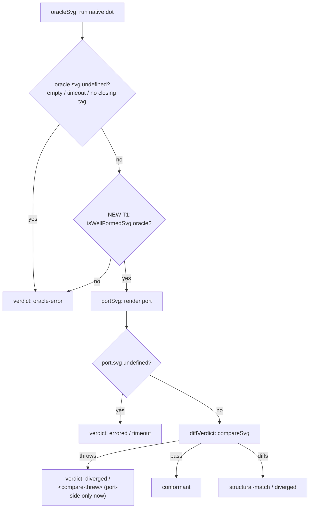

# Verdict decision flow

Current vs fixed path for a corpus input in `surveyOne`.

Before T1, the `C` node did not exist: a non-well-formed oracle fell through to
`F`, where `compareSvg` threw on the oracle and was mislabeled `diverged`
(`1472`). After T1, `C` routes it to `oracle-error`; only a genuine **port-side**
parse failure can still reach the `throws` edge at `F`.
