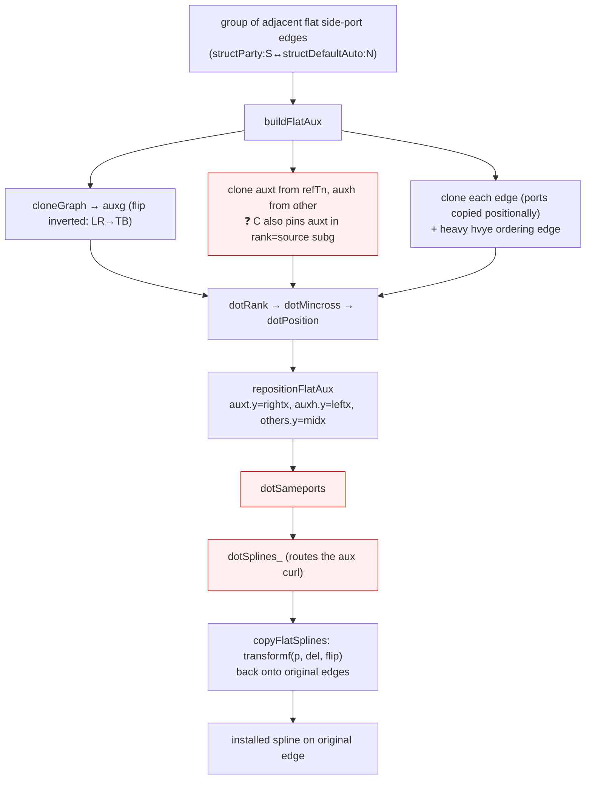

# make_flat_adj_edges aux pipeline

The flat-adjacent side-port router builds a rotated auxiliary graph, lays it
out, routes splines there, then transforms them back. The open defect is a
divergence between the port's and C's aux graph somewhere in this chain.

Verified faithful to C: `cloneGraph` flip-inversion, `repositionFlatAux`,
`del`, `transformf`, and (commit 480b34a) the `cloneFlatEdge` orientation
reference. Suspect nodes (red): the missing `rank=source` pin on `auxt`
(B2), and the aux `dotSameports`/`dotSplines_` curl (E/F) — a change to the
latter would breach the `splines-flat.ts`-only scope (AD-3) and is a
stop-and-check.
