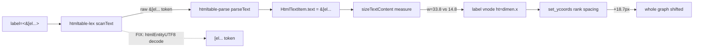
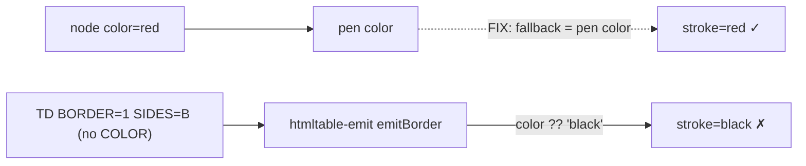

# 1949 data-flow

## D1 — where the HTML label text loses its entity decode

Native decodes at the lexer (expat), so `SIZE` sees `[el...` (w≈14.8) and no
shift occurs. The fix moves the port onto the decoded path.

## D2 — cell border color fallback

