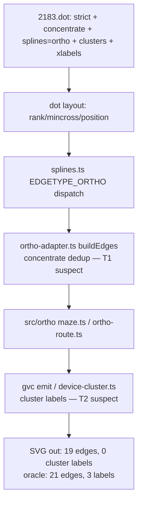

<!-- SPDX-License-Identifier: EPL-2.0 -->
# Component map — 2183 pipeline

```mermaid
graph TD
  IN[2183.dot: strict + concentrate + splines=ortho + clusters + xlabels] --> LAYOUT[dot layout: rank/mincross/position]
  LAYOUT --> DISPATCH[splines.ts EDGETYPE_ORTHO dispatch]
  DISPATCH --> ADAPTER[ortho-adapter.ts buildEdges<br/>concentrate dedup — T1 suspect]
  ADAPTER --> MAZE[src/ortho maze.ts / ortho-route.ts]
  MAZE --> EMIT[gvc emit / device-cluster.ts<br/>cluster labels — T2 suspect]
  EMIT --> SVG[SVG out: 19 edges, 0 cluster labels<br/>oracle: 21 edges, 3 labels]
```
