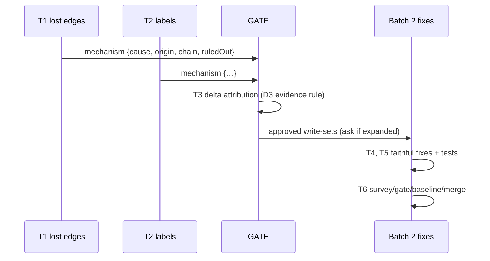

<!-- SPDX-License-Identifier: EPL-2.0 -->
# Diagnosis flow

```mermaid
sequenceDiagram
  participant T1 as T1 lost edges
  participant T2 as T2 labels
  participant G as GATE
  participant F as Batch 2 fixes
  T1->>G: mechanism {cause, origin, chain, ruledOut}
  T2->>G: mechanism {…}
  G->>G: T3 delta attribution (D3 evidence rule)
  G->>F: approved write-sets (ask if expanded)
  F->>F: T4, T5 faithful fixes + tests
  F->>F: T6 survey/gate/baseline/merge
```
