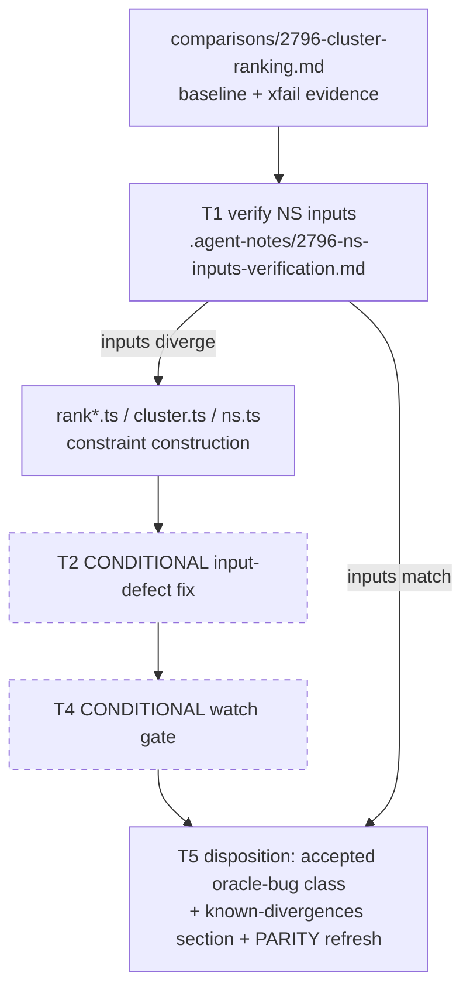

<!-- SPDX-License-Identifier: EPL-2.0 -->
# Component map — reduced scope

```mermaid
graph TD
    T1[T1 verify NS inputs<br/>.agent-notes/2796-ns-inputs-verification.md]
    RANK[rank*.ts / cluster.ts / ns.ts<br/>constraint construction]
    T2[T2 CONDITIONAL input-defect fix]
    T4[T4 CONDITIONAL watch gate]
    T5[T5 disposition: accepted oracle-bug class<br/>+ known-divergences section + PARITY refresh]
    CMP[comparisons/2796-cluster-ranking.md<br/>baseline + xfail evidence]

    CMP --> T1
    T1 -->|inputs diverge| RANK
    RANK --> T2 --> T4 --> T5
    T1 -->|inputs match| T5

    style T2 stroke-dasharray: 5 5
    style T4 stroke-dasharray: 5 5
```
