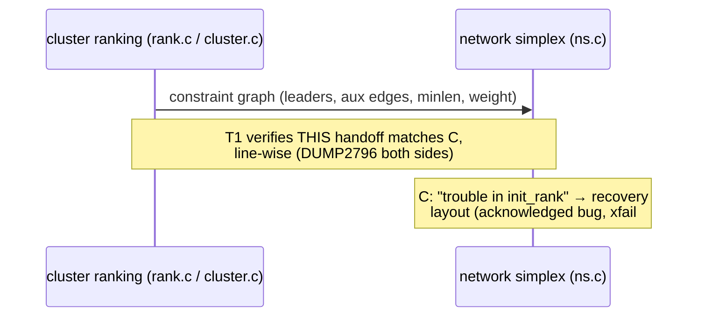

<!-- SPDX-License-Identifier: EPL-2.0 -->
# Data flow — the verification target

```mermaid
sequenceDiagram
    participant R as cluster ranking (rank.c / cluster.c)
    participant NS as network simplex (ns.c)

    R->>NS: constraint graph (leaders, aux edges, minlen, weight)
    Note over R,NS: T1 verifies THIS handoff matches C,<br/>line-wise (DUMP2796 both sides)
    Note over NS: C: "trouble in init_rank" → recovery<br/>layout (acknowledged bug, xfail #2796).<br/>Port: clean solve. NOT a target either way.
```
