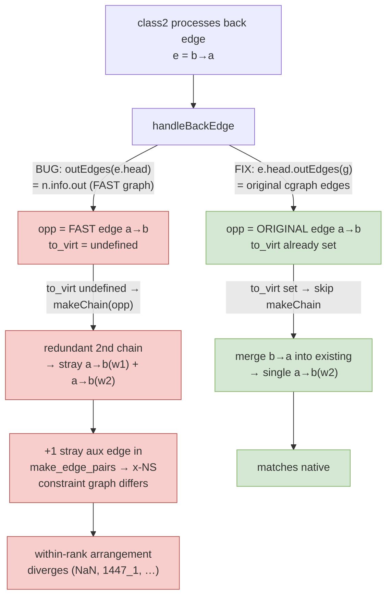

<!-- SPDX-License-Identifier: EPL-2.0 -->
# Component map — fix 2-cycle back-edge

C reference: `lib/dotgen/class2.c:259` iterates `agfstout(g, aghead(e))`
(original cgraph edges). The port's `class1` already does this
(`classify.ts:144`); only `class2`'s `handleBackEdge` regressed to the fast graph.
