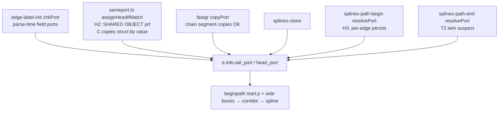

<!-- SPDX-License-Identifier: EPL-2.0 -->
# Port lifecycle — write sites under trace

```mermaid
graph TD
  INIT[edge-label-init chkPort<br/>parse-time field ports] --> E[e.info.tail_port / head_port]
  SP[sameport.ts assignHeadIfMatch<br/>H2: SHARED OBJECT prt<br/>C copies struct by value] --> E
  FG[fastgr copyPort<br/>chain segment copies OK] --> E
  CL[splines-clone] --> E
  BP[splines-path-begin resolvePort<br/>H3: per-edge persist] --> E
  EP[splines-path-end resolvePort<br/>T2 twin suspect] --> E
  E --> ROUTE[beginpath start.p + side boxes → corridor → spline]
```
