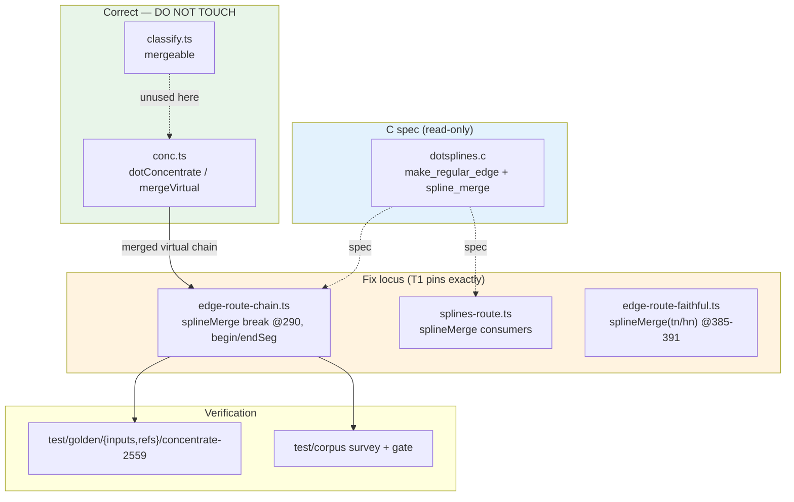

# Component map — touched vs out-of-scope

- **Green (out of scope):** merge detection + `mergeVirtual` — proven correct.
- **Orange (fix):** one of three routing files; T1 names the exact one.
- **Blue (spec):** C `make_regular_edge`/`spline_merge` — port faithfully (ADR-1).
