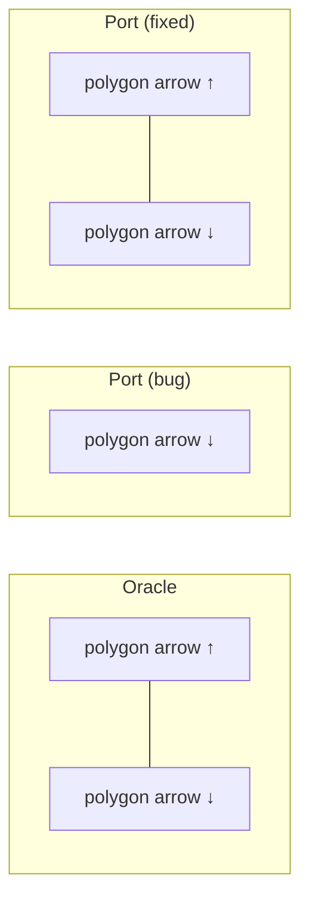

<!-- SPDX-License-Identifier: EPL-2.0 -->

# Data flow — concentrate arrowhead

How `conc_opp_flag` should drive both arrowheads and the spline clip.

```mermaid
sequenceDiagram
    participant C as classify.ts (class2)
    participant E as surviving edge A->B
    participant AF as arrowFlags(e)
    participant SC as arrowStart/EndClip
    participant SVG as svg emit

    Note over C: concentrate=true, opposing pair A->B / B->A
    C->>E: e.edge_type = IGNORED (back edge)
    C->>E: opp.conc_opp_flag = true  (surviving A->B)
    Note over AF: CURRENT BUG — branch missing
    AF->>AF: sflag=NONE, eflag=NORM (dir/attrs)
    rect rgb(220,255,220)
    Note over AF: FIX (ADR-1)
    AF->>AF: f = edge(B->A); [s0,e0]=arrowFlags(f)
    AF->>AF: eflag |= s0; sflag |= e0  ⇒ [NORM, NORM]
    end
    AF-->>SC: [sflag=NORM, eflag=NORM]
    SC->>SC: arrowStartClip (sflag) + arrowEndClip (eflag)
    SC-->>SVG: 2 arrowhead polygons + spline clipped both ends
```

## Before vs after (graphs-b135)


