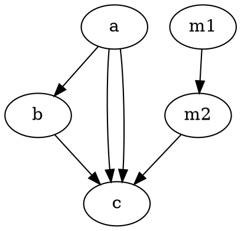

<!-- SPDX-License-Identifier: EPL-2.0 -->

# T0.1 — C edge dispatch order oracle (instrumented)

Authoritative ground truth from instrumented C (`GV_DUMP_MRE`-gated dumps in
`~/git/graphviz/lib/dotgen/dotsplines.c`: `[MRE-ORDER]` at the
`make_regular_edge`/`make_flat_edge` dispatch site ~L381; `[MRE-SLACK]` inside
`recover_slack`'s `resize_vn` call ~L2066). Rebuilt `gvplugin_dot_layout` →
`/tmp/ghl`; rendered with `GV_DUMP_MRE=1 GVBINDIR=/tmp/ghl dot -Tsvg`. The dumps
are stderr-only and do **not** alter geometry (oracle SVGs remain valid).

> **Cleanup owed:** revert the C instrumentation + `make gvplugin_dot_layout`
> before Batch 2 surveys / golden-ref regeneration (per T0.1 write-set).

## How C orders edges — `edgecmp` (dotsplines.c:543)

`dot_splines_` collects every edge segment (walking ranks top→bottom, appending
each node's `ND_out`), then `LIST_SORT(&edges, edgecmp)` and dispatches groups of
equivalent edges in one loop (L343-420). `edgecmp` sort keys, in order:

1. edge type (`EDGETYPEMASK`)
2. **`|rank diff|` of the _main_ edge, ascending** ← the load-bearing key
3. `|x diff|` of main-edge endpoints, ascending
4. `AGSEQ` of the main edge
5. tail/head port comparison
6. graph type; flat-edge labels; edge id

**Consequence (the whole mechanism):** a lone **adjacent** edge (`|rank diff| =
1`) sorts **before** any **multi-rank** edge/group (`|rank diff| ≥ 2`). C then
routes the lone edge first — reading shared chain vnodes at their pre-`recover_slack`
positions. The group is routed later and only then moves those vnodes.

## ldbxtried — full C dispatch order (52 groups)

`graphs/directed/ldbxtried.gv`, instrumented oracle. `pos` = index into the
sorted edge list; seq = dispatch sequence #. cnt>1 = parallel/opposing group.

Key positions:

| seq | pos | edge (main) | seg | cnt | rank | note |
|----|----|----|----|----|----|----|
| 30 | 34 | **`n0->n1`** | `n0->n1` | 1 | 0→1 | lone adjacent, `|diff|=1` |
| 52 | 67 | **`n0->n2`** | `n0->%0` | 3 | 0→1 seg / 0→4 main | parallel multi-rank group, `|diff|=4` |

`n0->n1` (seq 30) is routed **22 dispatches before** the `n0->n2` group (seq 52).
All 39 `cnt=1` lone edges and short groups cluster early; the 13 multi-rank
`...->%0` chains (diff ≥ 2) cluster at pos 35-67, with `n0->n2` last.

(Full 52-row list captured in `/tmp/ldbx-mre.txt`; the table above gives the two
load-bearing rows. Edge-type/x-diff break the ties within each `|rank diff|`
band — not needed for the mechanism.)

## The shared vnode move (`recover_slack`)

Many virtual nodes share the auto-name `%0` (the name resets per chain); the
**rank** + **y** disambiguate. The vnode `n0->n1` shares with the `n0->n2`
chain is the **rank-1 `%0`, y=473.1**. It is moved **only** by the `n0->n2`
group, at emission line 86 — *after* `n0->n1` routed (line 30):

```
[MRE-SLACK] by n0->n2 vn=%0 rank=1 y=473.1 x 967.0->789.0 box=[729.3,848.7] label=0
[MRE-SLACK] by n0->n2 vn=%0 rank=2 y=386.6 x 967.0->902.3 box=[899.0,905.6]
[MRE-SLACK] by n0->n2 vn=%0 rank=3 y=291.0 x 967.0->901.0 box=[897.0,905.1]
```

Interleave check (`/tmp/ldbx-mre.txt` lines 30-88): between `n0->n1`'s dispatch
(line 30) and `n0->n2`'s (line 85) there are 27 other `%0` moves — **all at rank
2/3/4/5** (different vnodes). The **rank-1 y=473.1 `%0` is untouched until line
86**. So in C:

| edge | seq | reads rank-1 `%0` at x = | result |
|----|----|----|----|
| `n0->n1` | 30 (before move) | **967** (original) | **7-pt corridor** ✓ |
| `n0->n2` group | 52 (performs move) | moves it 967→789 | 10-pt ×3 |

## C ground-truth splines (oracle SVG `/tmp/ldbx-oracle.svg`)

- `n0->n1`: **7 pts** — `M414.03,-556.21C534.16,-550.99 911.15,-532.52
  1028.89,-501.94 1032.73,-500.95 1036.67,-499.64 1040.52,-498.17`
- `n0->n2` ×3: 10 pts each (multi-rank, via the group router)

This 7-pt corridor is the Batch-1 golden target for `n0->n1`.

## Minimal synthetic repro — order signature (`/tmp/repro1.gv`)



Reproduces the **dispatch signature** (lone edge before a vnode-moving group it
shares a rank-1 chain vnode with):

```
[MRE-ORDER] pos=1 main=a->b  seg=a->b  cnt=1 rank 0->1   <- lone, |diff|=1, FIRST
[MRE-ORDER] pos=4 main=a->c  seg=a->%0 cnt=2 rank 0->1   <- group, multi-rank, LATER
[MRE-SLACK] by a->c vn=%0 rank=1 y=90.0 x 6.0->5.0 box=[4.8,5.2]   <- moves shared rank-1 %0
```

`a->b` (seq 1) routes before the `a->c` group (seq 4) moves the shared rank-1
`%0` — the same before/after-move relationship as ldbxtried `n0->n1`.

**Caveat (decided, see decision journal):** the synthetic move is tiny (6→5)
and C routes `a->b` straight (4 pts) regardless, so repro1 reproduces the *order
signature* but **not a geometric divergence**. Verified (instrumented C + port):
`repro1` port == C (both `a->b` = 4 pts). Tried wider/deeper synthetic shapes
(`/tmp/repro2`, `/tmp/repro3`) — a *large* `recover_slack` move that flips a
lone edge's point count needs the lateral-obstacle richness that only emerges at
ldbxtried's scale (a short adjacent edge curves only when its head is far with
obstacles between). **ldbxtried `n0->n1` is therefore the Batch-1 red golden;
repro1 is the minimal order-signature fixture.**

## Per-affected-lone-edge: before or after the move?

| lone edge | shares vnode | group that moves it | C routes lone … |
|----|----|----|----|
| ldbxtried `n0->n1` | rank-1 `%0` (y=473.1) | `n0->n2` (cnt=3, seq 52) | **before** the move (seq 30) ✓ |
| repro1 `a->b` | rank-1 `%0` | `a->c` (cnt=2, seq 4) | **before** the move (seq 1) ✓ |

## Acceptance — met

- ✅ ldbxtried order lists `n0->n1` **before** the `n0->n2` group; `%0`
  967→789 move attributed to the group.
- ✅ minimal repro reproduces the signature (lone dispatched before a
  vnode-moving group sharing a rank-1 chain vnode).
- ✅ explicit per lone edge: C routes it **before** the shared vnode's move.
